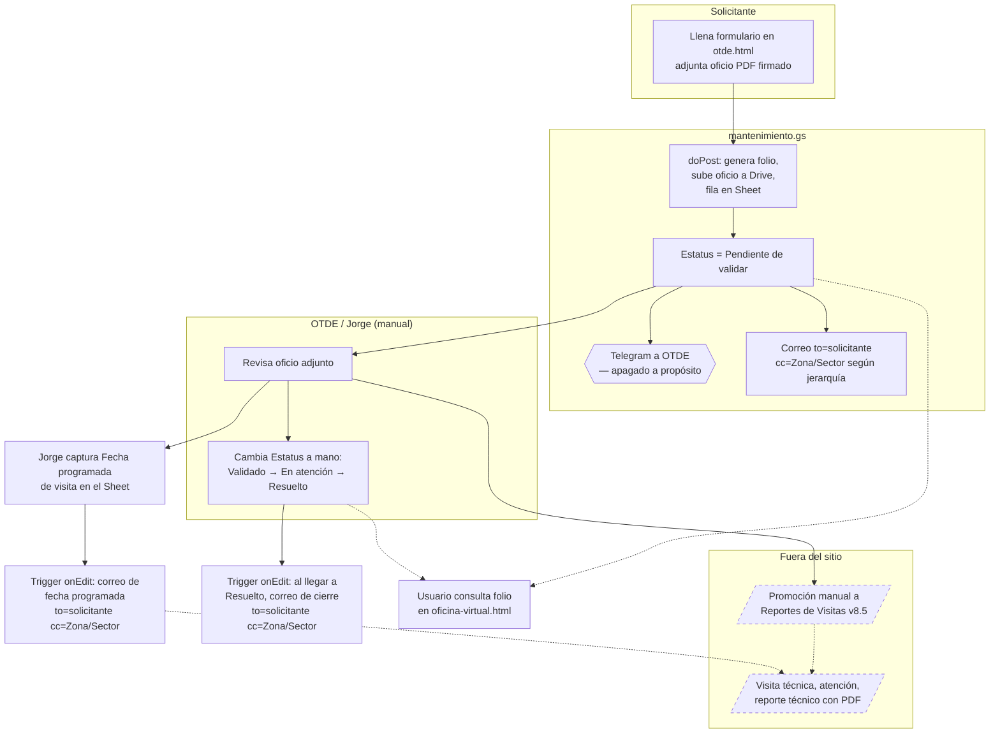
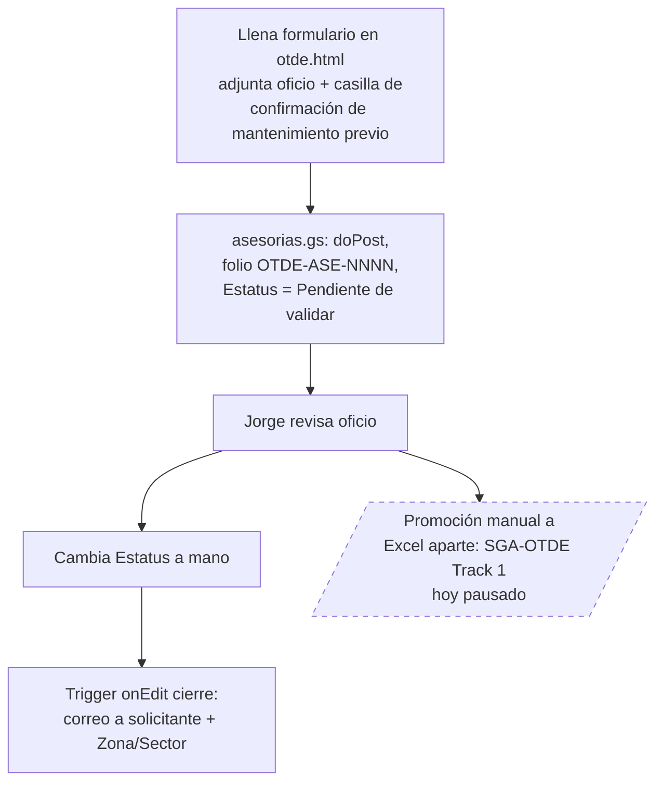
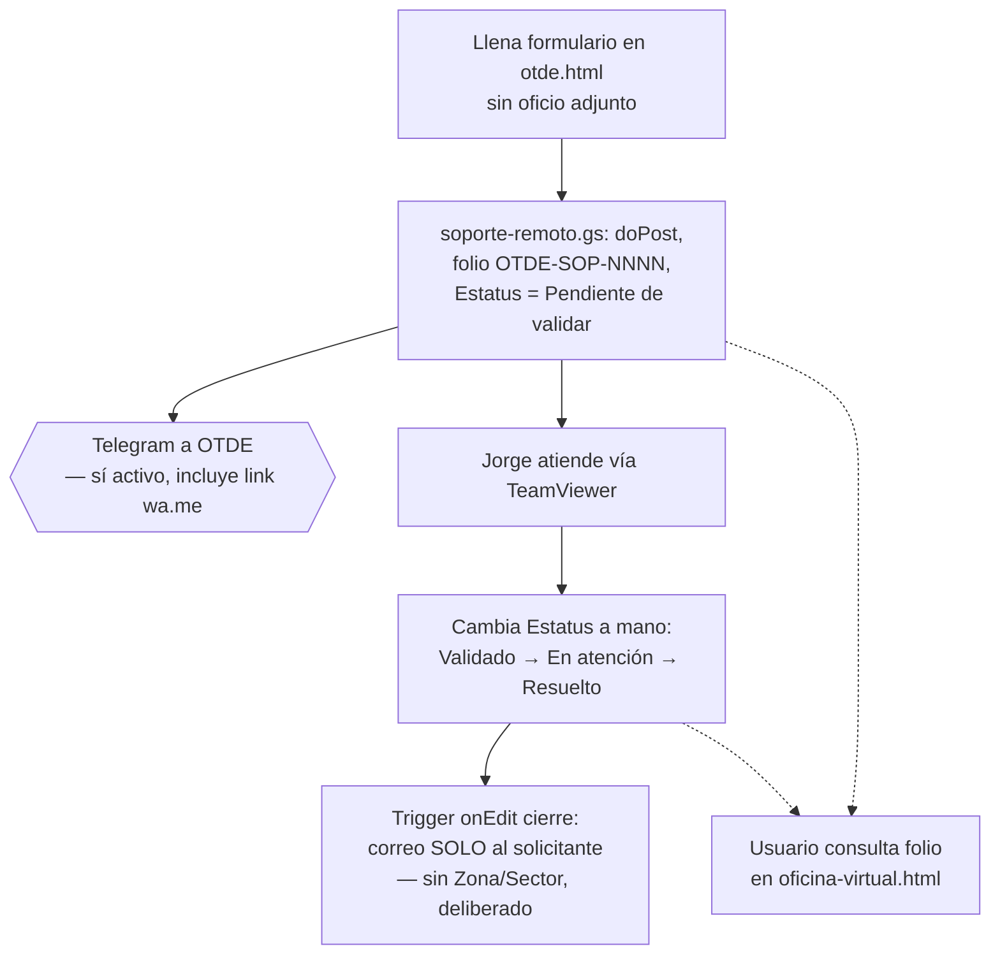
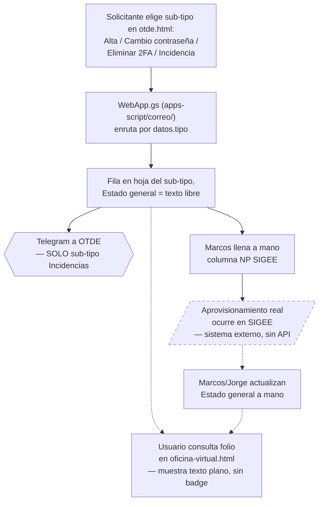
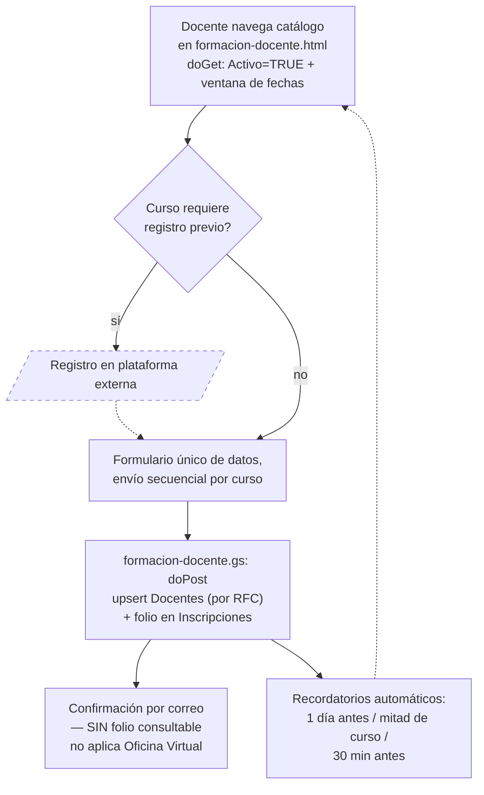

# Arquitectura y Convenciones — SEPRN Sitio Web

Describe el modelo mental del proyecto: cómo está construido, cómo fluye la información y qué reglas seguir para mantener la consistencia visual y técnica.

Ver [`ROADMAP.md`](ROADMAP.md) para el plan de mejoras hacia la versión premium.

---

## 1. Arquitectura general

El sitio es **100% estático**: HTML + CSS + JS. No hay servidor, base de datos, ni proceso de build.

```
Browser
  └── Carga HTML (cualquiera de los 17 archivos)
        ├── Descarga styles.css (único, cacheado)
        ├── Descarga Montserrat desde Google Fonts (via <link rel="preconnect"> en cada página)
        ├── Ejecuta GA4 tag (en <head>)
        └── Ejecuta script.js (defer, al final del body)
              ├── Hamburger menu (nav-toggle)
              └── IntersectionObserver → .area-card.visible + .fade-item.visible
        └── Ejecuta JS inline del body (por página)
              ├── toggleSesion() + lazy load iframes (cte.html)
              ├── IntersectionObserver animaciones (nosotros.html)
              └── Tooltip del mapa SVG (index.html)
```

No hay estado global, ni localStorage, ni cookies propias. La única "persistencia" es la analítica de GA4.

---

## 2. Estructura de plantilla por página

Cada página sigue este esqueleto HTML:

```html
<!DOCTYPE html>
<html lang="es">
<head>
    <!-- GA4 tag — debe ir DENTRO de <head>, como primera línea -->
    <script async src="https://www.googletagmanager.com/gtag/js?id=G-7D68DB8ELW"></script>
    <script>
      window.dataLayer = window.dataLayer || [];
      function gtag(){dataLayer.push(arguments);}
      gtag('js', new Date());
      gtag('config', 'G-7D68DB8ELW');
    </script>
    <meta charset="UTF-8">
    <meta name="viewport" content="width=device-width, initial-scale=1.0">
    <meta name="description" content="[Descripción única ~150 chars]">
    <title>[Nombre Sección] - SEPRN</title>
    <link rel="preconnect" href="https://fonts.googleapis.com">
    <link rel="preconnect" href="https://fonts.gstatic.com" crossorigin>
    <link rel="stylesheet" href="https://fonts.googleapis.com/css2?family=Montserrat:wght@300;400;500;600;700&display=swap">
    <link rel="icon" href="favicon.svg" type="image/svg+xml">
    <link rel="stylesheet" href="styles.css">
    <!-- Estilos locales SOLO si son exclusivos de esta página -->
    <style> ... </style>
</head>
<body>
    <a href="#main-content" class="skip-link">Saltar al contenido principal</a>
    <!-- 1. Header/Nav (idéntico en todas las páginas) -->
    <header>
        <nav>
            <div class="logo">SEPRN</div>
            <button class="nav-toggle" aria-label="Abrir menú" aria-expanded="false">
                <span></span><span></span><span></span>
            </button>
            <ul>
                <li><a href="index.html">Inicio</a></li>
                <li><a href="nosotros.html">Nosotros</a></li>
                <li><a href="areas.html">Áreas</a></li>
                <li><a href="cte.html">CTE</a></li>
                <li><a href="contacto.html">Contacto</a></li>
            </ul>
        </nav>
    </header>

    <!-- 2. Contenido principal -->
    <section class="content-section" id="main-content" role="main"> ... </section>

    <!-- 3. Footer (idéntico en todas las páginas) -->
    <footer> ... </footer>

    <!-- 4. script.js (siempre al final del body) -->
    <script src="script.js" defer></script>

    <!-- 5. Scripts inline de página (si aplica, después de script.js) -->
    <script> ... </script>
</body>
</html>
```

**Reglas críticas:**
- GA4 siempre dentro de `<head>`, como primera línea.
- `script.js` siempre al final del `<body>`, antes de cualquier JS inline de página.
- Los 5 ítems de nav en este orden en TODAS las páginas.
- Al página actual: `class="active"` + `aria-current="page"` en el `<a>` correspondiente.

---

## 3. Sistema de estilos

### Archivo global: `styles.css`

Toca este archivo solo cuando el cambio aplica a **todas** las páginas.

| Bloque CSS | Qué define |
|---|---|
| `<link rel="preconnect">` Google Fonts | Montserrat 300–700 (en `<head>` de cada página) |
| `*` reset | `box-sizing`, `margin`, `padding` |
| `body` | Fuente base, `color: #333333`, line-height |
| `header` / `nav` | Barra de navegación sticky |
| `.logo` | Logotipo texto SEPRN |
| `nav a`, `nav a:hover`, `nav a.active` | Links del menú y sus estados |
| `.nav-toggle` | Botón hamburguesa mobile (3 spans → X) |
| `:focus-visible` | Outline de accesibilidad 2px guinda |
| `.hero` | Sección hero de la portada |
| `.area-card` | Tarjetas de áreas en portada |
| `.section-header` / `.section-eyebrow` / `.section-title` | Encabezados de sección con eyebrow y líneas |
| `.metrics-strip` / `.metric-item` / `.metric-number` / `.metric-label` | Strip de métricas animadas (`index.html`) |
| `.btn-primary-dark` / `.btn-secondary-dark` | Botones para fondos oscuros (hero) |
| `.hero-badge` | Pill de contexto institucional |
| `.fade-item` / `.fade-item.visible` | Fade-up genérico para tarjetas internas (IntersectionObserver) |
| `.skip-link` | Saltar al contenido principal (accesibilidad) |
| `.section-header-light` | Modificador de `.section-header` para fondos oscuros |
| `.ns-bloque` / `.ns-*` | Bandas de color alternantes en `nosotros.html` |
| `.ns-inner` / `.ns-inner.visible` | Fade-up de contenido en bandas nosotros |
| `.leadership` | Sección de equipo directivo (portada) |
| `footer` / `.footer-grid` / `.footer-col` / `.footer-bottom` | Pie de página multi-columna |
| `.content-section` | Contenedor de páginas internas |
| `.video-grid` / `.video-card` | Grid de videos |
| `@media (max-width: 768px)` | Breakpoint mobile principal |
| `@media (max-width: 480px)` | Breakpoint mobile pequeño |

### Estilos locales (en `<style>` dentro del `<head>` de cada página)

Úsalos **solo** para componentes que no existen en ninguna otra página:
- `.sesion-accordion` — exclusivo de `cte.html`
- `.ns-texto-lead` — única clase local de `nosotros.html` (las bandas `.ns-bloque` y estilos de valores/equipo están en `styles.css`)
- `.area-hero`, `.funciones-lista`, `.oficinas-grid` — exclusivo de páginas de área

**Nunca** redefinir clases que ya existen en `styles.css` (como `.area-card`) en estilos locales.

**Íconos de contacto:** usar SVG inline en `<span class="contacto-icon">`, no emojis. Ver patrón en cualquier página de área (persona, correo, teléfono).

> **Alerta — bug conocido:** No definir una CSS custom property con `var()` de sí misma (ej. `--midnight: var(--midnight)`). El browser descarta el valor y toda regla que use `var(--midnight)` queda inválida silenciosamente.

---

## 4. Sistema de diseño (Design Tokens)

### Paleta de colores

```css
/* Variables implementadas en styles.css */
:root {
    --guinda:          #56212f;   /* Identidad, títulos, footer bg */
    --guinda-acento:   #9F2241;   /* Énfasis, números, links activos */
    --arena:           #d6d1ca;   /* Fondos de tarjetas, separadores */
    --caramelo:        #c3b08f;
    --caramelo-hover:  #bc955b;
    --caramelo-oscuro: #6b5a44;   /* AA-compliant sobre blanco */
    --caramelo-claro:  #ddc8a4;
    --midnight:        #0C1A2E;   /* Hero oscuro, fondo de ancla */
    --off-white:       #F9F8F5;   /* Fondos cálidos, strip de métricas */
    --texto:           #333333;
    --texto-muted:     #555555;
}
```

### Tipografía

| Elemento | Tamaño desktop | Tamaño mobile | Peso | Tracking |
|---|---|---|---|---|
| Hero H1 | 64px | 40px | 700 | -2.5px |
| Sección H1 | 48px | 32px | 600 | -1px |
| H2 | 32–38px | — | 600–700 | -0.8px |
| H3 | 24px | — | 600 | — |
| Cuerpo | 16px | 16px | 400 | — |
| Hero párrafo | 19px | 16px | 400 | — |
| Label / eyebrow | 11px | — | 700 | +1.8px uppercase |
| Micro / copyright | 12px | — | 400 | — |

Reglas: letter-spacing negativo en headings. `line-height: 1.8` en cuerpos largos. **Sin `text-align: justify`**.

### Espaciado (múltiplos de 8px)

| Token propuesto | Valor | Uso típico |
|---|---|---|
| `--space-xs` | 8px | Gaps internos, padding micro |
| `--space-sm` | 16px | Padding de chips, separadores |
| `--space-md` | 24px | Gap entre elementos de un componente |
| `--space-lg` | 40px | Padding de secciones internas |
| `--space-xl` | 60px | Separación entre secciones |
| `--space-2xl` | 80px | Padding de páginas |
| `--space-3xl` | 100px | Márgenes de hero |

### Bordes y radios

| Elemento | Radio |
|---|---|
| Cards principales | `18px` |
| Cards secundarias | `12px` |
| Badges / chips | `20px` (pill) |
| Botones | `8–10px` |
| Inputs / campos | `8px` |

---

## 5. Componentes del sistema de diseño (actualizado 24 jun 2026)

Clases reutilizables en `styles.css`. Usar estas en lugar de estilos inline cuando sea posible.

### Hero oscuro — variante completa (`index.html`)

```html
<section class="hero">
    <div class="hero-inner">
        <div class="hero-badge">Etiqueta institucional</div>
        <h1>Título principal</h1>
        <p>Subtítulo</p>
        <div class="hero-actions">
            <a href="#" class="btn-primary-dark">CTA primario</a>
            <a href="#" class="btn-secondary-dark">CTA secundario</a>
        </div>
        <div class="hero-scroll" aria-hidden="true"></div>
    </div>
    <div class="hero-glow" aria-hidden="true"></div>
</section>
```

- Fondo: `#0C1A2E` (midnight), full-bleed
- Entrada: animaciones `hero-enter` escalonadas (stagger 150ms por elemento)
- Scroll indicator: dot pulsante animado en loop

### Métricas strip

```html
<div class="metrics-strip">
    <div class="metrics-inner">
        <div class="metric-item">
            <span class="metric-number" data-target="417">0</span>
            <span class="metric-label">Escuelas<br>oficiales</span>
        </div>
        <!-- repetir por cada métrica -->
    </div>
</div>
```

- Requiere el JS de `index.html` (IntersectionObserver + `animateCounter`)
- 4 columnas en desktop, 2×2 en mobile
- Separadores verticales automáticos con `::before`

### Section header

```html
<div class="section-header">
    <div class="section-eyebrow">Categoría · Subcategoría</div>
    <h2 class="section-title">Título de la sección</h2>
</div>
```

- Eyebrow: texto uppercase con líneas laterales (pseudo-elementos `::before` y `::after`)
- Centrado por defecto

### Botones

| Clase | Fondo | Uso |
|---|---|---|
| `btn-primary` | guinda sólido | Fondos claros |
| `btn-secondary` | transparente + borde guinda | Fondos claros |
| `btn-primary-dark` | `#F9F8F5` sólido | **Fondos oscuros (hero)** |
| `btn-secondary-dark` | transparente + borde blanco | **Fondos oscuros (hero)** |

### Hero oscuro — variante compacta (`hero-sm`, páginas internas)

```html
<section class="hero hero-sm">
    <div class="hero-inner">
        <span class="hero-badge">NOMBRE ÁREA · SEPRN</span>
        <h1>Título de la Página</h1>
        <p>Subtítulo descriptivo breve</p>
    </div>
    <div class="hero-glow" aria-hidden="true"></div>
</section>
```

- Idéntico al hero principal pero con `padding` reducido (via `.hero-sm`)
- Usado en `nosotros.html` y todas las páginas de área internas

### Fade-up genérico (`.fade-item`)

Para animar tarjetas en páginas internas, agregar la clase `fade-item` al elemento:

```html
<div class="oficina-card fade-item">...</div>
```

El `script.js` global observa todos los `.fade-item` y les agrega `.visible` al entrar al viewport. No requiere JS adicional por página.

### Skip to content (`.skip-link`)

Primera línea del `<body>` en todas las páginas:

```html
<body>
<a href="#main-content" class="skip-link">Saltar al contenido principal</a>
```

Y en la sección principal:

```html
<section class="content-section" id="main-content" role="main">
```

### Card de área con animación de entrada

Las `.area-card` requieren IntersectionObserver para activar la clase `.visible`:

```javascript
const obs = new IntersectionObserver(entries => {
    entries.forEach(e => { if (e.isIntersecting) e.target.classList.add('visible'); });
}, { threshold: 0.12 });
document.querySelectorAll('.area-card').forEach((c, i) => {
    c.style.transitionDelay = (i * 70) + 'ms';
    obs.observe(c);
});
```

---

## 6. Componentes documentados (originales)

### Header / Nav (estado actual)

```html
<header>
    <nav>
        <div class="logo">SEPRN</div>
        <button class="nav-toggle" aria-label="Abrir menú" aria-expanded="false">
            <span></span><span></span><span></span>
        </button>
        <ul>
            <li><a href="index.html">Inicio</a></li>
            <li><a href="nosotros.html">Nosotros</a></li>
            <li><a href="areas.html">Áreas</a></li>
            <li><a href="cte.html">CTE</a></li>
            <li><a href="contacto.html">Contacto</a></li>
        </ul>
    </nav>
</header>
```

El `script.js` global maneja el toggle del menú hamburguesa (clase `.open` en `nav-toggle` y `nav ul`).

Todas las páginas tienen `class="active"` + `aria-current="page"` en el `<a>` correspondiente.

### Footer

Bloque idéntico en todas las páginas. Si cambia la dirección o el horario, hay que actualizarlo en los ~16 archivos. **Deuda técnica**: considerar extraer a un componente via `fetch()` en el futuro.

### Acordeón CTE (`sesion-accordion`)

```html
<div class="sesion-accordion [active]">
    <button class="sesion-header" type="button" onclick="toggleSesion(this)" aria-expanded="[true|false]">
        <div class="sesion-header-text">
            <h2>[Nombre Sesión] [Ciclo escolar]</h2>
            <p>[Descripción breve]</p>
        </div>
        <div class="sesion-toggle">
            <svg width="20" height="20" viewBox="0 0 24 24" fill="none" stroke="currentColor" stroke-width="2.5" stroke-linecap="round" stroke-linejoin="round">
                <polyline points="6 9 12 15 18 9"/>
            </svg>
        </div>
    </button>
    <div class="sesion-content">
        <div class="sesion-content-inner">
            <!-- videos (src en activa, data-src en colapsadas), materiales, link SEP -->
        </div>
    </div>
</div>
```

**Estado actual:**
- Solo la sesión más reciente lleva `class="active"` y `aria-expanded="true"`. Las demás tienen `aria-expanded="false"`.
- Los iframes de sesiones colapsadas usan `data-src` (lazy load al abrir el acordeón).
- El JS en `cte.html` cierra todas las demás al abrir una y carga los iframes.
- La animación usa `grid-template-rows: 0fr → 1fr` con `transition: 0.35s ease` (técnica sin `max-height`).

### Grid de materiales (CTE)

Cada material usa `.material-item` con un `.material-icon` SVG (PNG por tipo de archivo), `.material-info` y un `<a href>` con `download`.

- PDF → icono de documento con líneas
- DOCX → icono de documento con W
- PPTX → icono de presentación
- ZIP → icono de caja/archivo comprimido

Los paths de archivos con acentos o espacios deben estar URL-encoded (ej. `S%C3%A9ptima-sesion.zip`, `fase3%20segundo-1.pdf`).

### Mapa SVG (Cobertura)

Hardcodeado en `index.html`. Municipios como `<polygon>` con `data-nombre` y `data-sector`. El tooltip se maneja con JS inline. Soporte touch implementado (`touchstart { passive: false }`, tooltip centrado fijo, auto-cierre 2.8s).

---

## 6. Flujo de actualización de contenido

### Agregar nueva sesión CTE

1. Crear subcarpeta: `pdfs/cte/[nombre]-sesion/` (sin acentos en el nombre de la carpeta).
2. Subir archivos (DOCX, PPTX, PDF, ZIP). Usar nombres URL-friendly (guiones, sin espacios).
3. En `cte.html`:
   - En la sesión anterior: quitar `class="active"`, quitar badge "NUEVO", convertir `src=` → `data-src=` en los iframes.
   - Agregar nuevo bloque `sesion-accordion` con `class="active"` y badge "NUEVO".
4. Hacer commit y push.

### Actualizar equipo directivo

Editar `nosotros.html` (bloque "Equipo de Trabajo") y `areas.html` (campo `area-responsable` de cada tarjeta).

### Agregar nueva página de área

1. Copiar `juridico.html` como plantilla (es la más simple).
2. Actualizar `<title>`, meta description, header, contenido.
3. Marcar `class="active"` en el nav correspondiente.
4. Agregar tarjeta en `areas.html`.
5. Agregar enlace en `nosotros.html` (organigrama).
6. Verificar checklist de nueva página (ver Sección 9).

---

## 7. Integraciones externas

| Servicio | Propósito | Configuración |
|---|---|---|
| Google Analytics 4 | Analítica de visitas | ID: `G-7D68DB8ELW` — en `<head>` de cada página |
| Google Fonts | Tipografía Montserrat | `<link rel="preconnect">` + `<link>` en `<head>` de cada página |
| Google Maps Embed | Mapa en `contacto.html` | URL de embed en el `<iframe>` |
| YouTube Embed | Videos de sesiones CTE | `src` (sesión activa) / `data-src` (colapsadas, lazy load) |
| Portal SEP CTE | Link externo | `https://gestion.cte.sep.gob.mx/insumos/#!/` |
| Facebook | Redes sociales | `https://www.facebook.com/SubNeza` |
| YouTube Channel | Redes sociales | `https://www.youtube.com/channel/UCvDb2DPSJxFyhH3bCPd5D2Q` |
| Google Apps Script | 4 backends independientes | `conferencia-ia.gs` (evento IA), `cursos-coeee-2026.gs` (Jornada Verano), `soporte-remoto.gs` (Soporte OTDE), `formacion-docente.gs` (Centro de Formación Docente) — cada uno Web App con `doGet`/`doPost`, URL embebida como constante en su página correspondiente |
| GmailApp (Apps Script) | Correo de confirmación | Envía HTML con QR; remitente: "Oficina de Tecnología · Neza" (usado por `conferencia-ia.gs`) |
| api.qrserver.com | Generación de QR en correo | URL dinámica con folio codificado; solo en correos de confirmación |
| html5-qrcode v2.3.8 | Escáner QR en `asistencia.html` | CDN `unpkg.com`; modo cámara trasera `environment` |
| Bot de Telegram (API `sendMessage`) | Notificación push de solicitudes de Soporte Remoto | Token y chat_id en Propiedades del script de `soporte-remoto.gs` (nunca hardcodeados); incluye link `wa.me` al WhatsApp del solicitante |

---

## 8. Sistema de Registro de Eventos (Junio 2026)

Arquitectura del sistema implementado para la Conferencia IA 2026. Reutilizable para futuros eventos con ajustes mínimos en el Apps Script y la base CCT.

### Diagrama de flujo

```
Visitante
  └── conferencia-ia.html
        ├── js/cct-db.js (autocompletado CCT, 506 registros)
        ├── fetch ?action=cupo  ──────────────────────────────────────┐
        └── POST datos del formulario ─────────────────────────────── Apps Script Web App
                                                                        │   (conferencia-ia.gs)
                                                                        ├── Google Sheets (Registros_IA_2026)
                                                                        └── GmailApp → correo HTML + QR

Operador en puerta
  └── asistencia.html
        ├── PIN local (sessionStorage) — sin red
        ├── html5-qrcode (cámara) o lector físico o tipeo manual
        └── fetch ?action=checkin&folio=...&pin=... ──────────────── Apps Script Web App
                                                                        └── Google Sheets (cols M + N)
```

### Estructura de la hoja `Registros_IA_2026`

| Col | Nombre | Tipo | Notas |
|---|---|---|---|
| A | Fecha | DateTime | `appendRow` inserta objeto `Date` |
| B | Folio | String | `CONF-{SECTOR}-{nn}` o `CONF-{SECTOR}-{nn}-LE` |
| C | Nombre | String | Validado: mín. 3 palabras de ≥ 2 letras |
| D | RFC | String | Regex `[A-ZÑ&]{3,4}\d{6}[A-Z0-9]{3}` |
| E | Teléfono | String | Máscara `(55) 1234-5678` |
| F | Correo | String | Regex básica de email |
| G | Función | String | docente / director / supervisor / familiar / otro |
| H | CCT | String | Clave del Centro de Trabajo |
| I | Sector | String | De la CCT seleccionada |
| J | Zona | String | De la CCT seleccionada (puede ser vacío) |
| K | Escuela/Unidad | String | Nombre del plantel de la CCT |
| L | Estado | String | `ok` \| `lista_espera` |
| M | Asistencia | String | Vacío → `asistio` al hacer check-in |
| N | Hora_Checkin | String | `HH:mm` formateado; `@STRING@` para evitar reinterpretación |

### Constantes clave del Apps Script

```javascript
const HOJA_NOMBRE  = 'Registros_IA_2026'; // cambiar por evento
const CUPO_SECTOR  = 7;                    // cupo por sector (sin contar SEPRN)
const CORREO_ADMIN = 'adg0086n@dee.edu.mx';
const CHECKIN_PIN  = '2026IA';             // cambiar antes del evento
```

### Decisiones de diseño y limitaciones conocidas

- **PIN en dos capas**: `asistencia.html` valida el PIN localmente (sin red) para mostrar el scanner; el Apps Script también valida el PIN en `?action=checkin` como segunda línea de defensa.
- **Hora como texto**: Google Sheets convierte cadenas `HH:mm` a fracciones de día (float) si la celda tiene formato numérico. Forzar `@STRING@` en la columna N previene esta corrupción.
- **QR por email**: Se genera dinámicamente con `api.qrserver.com`. Requiere que el cliente de correo cargue imágenes externas. iCloud Mail las carga correctamente.
- **iCloud Mail y emojis**: Los clientes de correo de Apple no renderizan caracteres Unicode SMP (U+1F000+) aunque sean HTML entities. Solución: etiquetas de texto puro con estilo CSS.
- **Cupo sector SEPRN**: El sector "SEPRN" (personal interno) no tiene límite de cupo (`CUPO_SECTOR` no aplica).

---

## 9. Bugs y deuda técnica

### Bugs resueltos (Mayo 2026)

| # | Descripción | Archivo(s) | Estado |
|---|---|---|---|
| B1 | GA4 script fuera de `<head>` | Todos los HTML | ✅ Resuelto |
| B2 | `referrerpolicy="strict-origin-when-cross-cross"` (typo) | `cte.html` | ✅ Resuelto |
| B3 | Nav de `contacto.html` omitía "Nosotros" | `contacto.html` | ✅ Resuelto |
| B4 | No había regla CSS para `.active` en nav | `styles.css` | ✅ Resuelto |
| B5 | `target="_blank"` sin `rel="noopener noreferrer"` | Todos los HTML | ✅ Resuelto |
| B6 | Sin menú hamburguesa para móvil | `styles.css` + todos los HTML | ✅ Resuelto |
| B7 | `text-align: justify` en `nosotros.html` | `nosotros.html` | ✅ Resuelto |
| B8 | Color de texto `#000000` | `styles.css` | ✅ Resuelto |
| B9 | Sin `<meta name="description">` | Páginas clave | ✅ Resuelto |

### Resueltos en Fase 1 (junio 2026)

| # | Problema | Archivo(s) | Estado |
|---|---|---|---|
| P1 | Sin `class="active"` en nav de 14+ páginas | Todos los HTML | ✅ `fd707cf` |
| P2 | Sección cobertura rota en mobile (sin media query) | `index.html` | ✅ `9502c7f` |
| P3 | Google Fonts via `@import` (render-blocking) | `styles.css` + todos | ✅ `59086e9` |
| P4 | Contraste subtítulo hero: `#977e5b` (ratio 3.5:1, falla WCAG AA) | `styles.css` | ✅ `59086e9` |
| P5 | Accordion headers son `<div onclick>` (no semántico) | `cte.html` | ✅ `9502c7f` |
| P6 | Sin `aria-current="page"` en ninguna página | Todos los HTML | ✅ `fd707cf` |
| P7 | Touch targets insuficientes en nav mobile | `styles.css` | ✅ `59086e9` |
| P8 | Sin favicon en ninguna página | Todos los HTML | ✅ `fd707cf` |
| P9 | Toggles accordion con caracteres `▼▶` (no fluido) | `cte.html` | ✅ `9502c7f` |

### Resueltos en sesiones posteriores

| # | Problema | Archivo(s) | Estado |
|---|---|---|---|
| P10b | Acordeón `<div onclick>` → `<button>` semántico con `aria-expanded` | `cte.html` | ✅ Fase 1.5 |
| P10c | Toggles `▼▶` → SVG chevron animado con CSS `rotate` | `cte.html` | ✅ Fase 1.9 |
| P10d | Animación acordeón `max-height` → `grid-template-rows` | `cte.html` | ✅ Fase 2.3 |
| P10e | Hero midnight en páginas de área | `*.html` | ✅ jun 2026 |
| P10f | Section headers sistema de diseño en páginas internas | `*.html` | ✅ 24 jun 2026 |
| P10g | `.skip-link` + `role="main"` en páginas de área | `*.html` | ✅ 24 jun 2026 |
| P10h | Tokens `--midnight` y `--off-white` migrados a `:root` | `styles.css` | ✅ 24 jun 2026 |
| P11 | Footer multi-columna (3 cols + barra inferior) en las 13 páginas | Todos los HTML | ✅ 24 jun 2026 |
| P13 | ARIA tabs + `aria-expanded` en formularios de `otde.html` | `otde.html` | ✅ 24 jun 2026 |
| P14 | Mapa SVG sin soporte touch | `index.html` | ✅ 24 jun 2026 |
| P15 | Bug: `--midnight: var(--midnight)` (autorreferencia) dejaba heroes transparentes | `styles.css` | ✅ 24 jun 2026 |
| P16 | `areas.html` y `cte.html` sin hero midnight (inconsistencia visual) | `areas.html`, `cte.html`, `contacto.html` | ✅ 24 jun 2026 |
| P17 | Emojis en `otde.html` (tabs, headings, íconos decorativos) | `otde.html` | ✅ 24 jun 2026 |
| P18 | Emojis 👤/📧/📞 en secciones de contacto de páginas de área | 6 páginas de área | ✅ 24 jun 2026 |
| P19 | URLs portal SEP con `#!/` obsoleto y `www.` incorrecto en `cte.html` | `cte.html` | ✅ 24 jun 2026 |

### Pendientes

| # | Problema | Archivo(s) | Fase |
|---|---|---|---|
| P12 | Footer y nav duplicados en ~16 archivos (sin componente compartido) | Todos los HTML | Deuda técnica |

---

## 10. Checklist para nuevas páginas

Antes de hacer commit de una página nueva:

- [ ] `<html lang="es">`
- [ ] GA4 tag **dentro** de `<head>` (primera línea de `<head>`)
- [ ] `<meta charset="UTF-8">`, `<meta name="viewport" ...>`, `<meta name="description" content="...">`
- [ ] `<title>[Sección] - SEPRN</title>`
- [ ] `<link rel="preconnect">` × 2 + `<link>` de Montserrat
- [ ] `<link rel="icon" href="favicon.svg" type="image/svg+xml">` + `<link rel="icon" type="image/png" sizes="192x192" href="favicon-192.png">` (el PNG es obligatorio — WhatsApp y la mayoría de crawlers de redes sociales no rasterizan favicons SVG para la vista previa del link, ver §23)
- [ ] `<link rel="stylesheet" href="styles.css">`
- [ ] OG tags: `og:type`, `og:site_name`, `og:title`, `og:description`, `og:url`, `og:image` (usar siempre `https://educaneza.github.io/seprn-sitio/images/og-image.png` salvo que la página tenga una imagen propia más representativa)
- [ ] Primera línea de `<body>`: `<a href="#main-content" class="skip-link">Saltar al contenido principal</a>`
- [ ] Nav completo con los 5 ítems + `nav-toggle` + `class="active"` + `aria-current="page"` en el ítem actual
- [ ] Sección hero: `<section class="hero hero-sm">` con `.hero-badge`, `<h1>`, `<p>`, `.hero-glow`
- [ ] Contenido: `<section class="content-section" id="main-content" role="main">`
- [ ] Secciones internas con `.section-header` + `.section-eyebrow` + `.section-title` (no `.seccion-titulo`)
- [ ] Tarjetas con `class="oficina-card fade-item"` para animación al scroll
- [ ] Footer completo (copiar del template)
- [ ] `<script src="script.js" defer></script>` antes de `</body>`
- [ ] `rel="noopener noreferrer"` en todos los `target="_blank"`
- [ ] Sin `text-align: justify`; texto de cuerpo en `#333333`

---

## 11. Patrón: CCT con autocompletado + fallback manual (Julio 2026)

Implementado primero en `jornada-verano-2026.html`, reutilizado en el formulario de Soporte Técnico Remoto de `otde.html` y en `formacion-docente.html`. Si se necesita en una nueva página, replicar este patrón en vez de inventar uno nuevo.

**Piezas del patrón:**
- `js/cct-db.js` — 506 registros `{cct, nombre, sector, zona, tipo, municipio}`. Cargar con `<script src="js/cct-db.js"></script>` antes del script inline de la página. El campo `municipio` (agregado jul 2026 desde `Catalogo SEPRN direcciones.xlsx`) se autocompleta igual que sector/zona/escuela — **no** se deriva del sector, porque un mismo sector puede abarcar varios municipios (ver mapa SVG de `index.html`); en el fallback manual (CCT no encontrada) el municipio queda vacío, no se le pide al usuario.
- Input de texto con `<ul id="...-suggestions">` absoluto debajo, poblado en el evento `input` (mínimo 3 caracteres, máximo 10 resultados) y navegable con flechas/Enter/Escape.
- Al seleccionar una sugerencia: llenar inputs ocultos `sector-val` / `zona-val` / `escuela-val` y marcar una bandera `cctEncontrada = true`.
- Si el usuario escribe una CCT que no existe (evento `change` sin `cctEncontrada`): mostrar bloque `.manual-fields` con un `<select>` de **Tipo de CCT** primero (Escuela / Zona escolar-Supervisión / Sector educativo-Jefatura / SEPRN, función `*ActualizarTipoCct()`), que decide si se muestran Sector+Zona (escuela/supervision), solo Sector (jefatura) o ninguno de los dos (subdireccion/SEPRN) — reemplaza, desde agosto 2026, al diseño anterior donde `SEPRN` era una opción más dentro del `<select>` de Sector (ese diseño viejo tenía un bug real: una CCT de tipo `jefatura` quedaba forzada a contestar también "Zona", que no le aplica). El `<select>` de Zona sigue poblándose dinámicamente vía `actualizarZonas()` a partir de un mapa `sector → zonas[]` derivado de `CCT_DB`, e `<input>` de Escuela/Unidad sin cambios.
- **Validación por campo, no agrupada**: Tipo de CCT, Sector, Zona y Escuela deben validar y mostrar su propio mensaje de error. Agrupar todo bajo el mensaje del campo CCT es un anti-patrón ya corregido dos veces (`jornada-verano-2026.html` lo resolvió como "BUG 4/5 fix"; `otde.html` lo resolvió en jul 2026) — Sector es obligatorio salvo en SEPRN, Zona solo en escuela/zona escolar.
- El formulario que use este patrón debe llevar `novalidate` en el `<form>` y validación 100% en JS (`onchange`/`onsubmit`), porque los atributos `required`/`type="email"` nativos interceptan el `submit` antes de que corra la validación personalizada.
- **Función/Cargo ramificada por tipo de CCT (agosto 2026)**: `js/cct-db.js` ya traía un campo `tipo` por registro (`escuela|supervision|jefatura|subdireccion`) que antes solo alimentaba el cálculo de dominio de correo (ver §16). La función compartida `otdeOpcionesFuncion(tipo)` (en `cct-db.js`) devuelve la lista de roles válida para ese tipo — escuela: Director(a)/Subdirector(a)/Docente/Personal de apoyo (PAAE); zona: Supervisor(a) Escolar/ATP/PAAE; sector: Supervisor(a) General/ATP/PAAE; SEPRN: Encargado(a) del Despacho/Subjefe(a)/Jefe(a) de Oficina/ATP/Administrativo (PAAE); siempre con "Otro" al final — y el helper de DOM `otdePoblarFuncion(selectId, tipo)` en `otde.html` repuebla el `<select>` de Función conservando la selección previa si sigue siendo válida. Se llama tanto al encontrar la CCT por autocompletado (usa `m.tipo` de `CCT_DB`) como al elegir el Tipo de CCT manual — los 4 formularios que preguntan Función (Alta, Mantenimiento, Asesorías, Soporte) lo usan. No requirió cambios de backend: los `.gs` correspondientes solo validan que `funcion` no venga vacío.

---

## 12. Centro de Formación Docente (Julio 2026 — desplegado en producción)

Nace de sistematizar el flujo real de convocatorias CoEEE (webinars, seminarios, conferencias, cursos autogestivos, acciones formativas, diplomados, proyectos didácticos), antes resuelto con un Google Form distinto por curso y sin seguimiento del ciclo de vida del participante. Diseño discutido y validado con Jorge antes de implementar. Desplegado en el Spreadsheet real `Formacion_Docente_2026_2027`; `jornada-verano-2026.html` hizo cutover a este mismo backend (ver §14).

### Modelo de datos — 3 hojas relacionales en un solo Spreadsheet (no una hoja por curso)

```
Docentes                    Cursos                              Inscripciones
─────────                   ──────                              ─────────────
RFC (llave, upsert)          ID_Curso (llave)                     Folio (llave, OTDE-CAP-NNNN)
Nombre_completo              Categoria                             Fecha_registro
Correo                       Nombre                                RFC_Docente     ──┐ FK
Telefono                     Responsable                           ID_Curso        ──┤ FK
CCT                          Modalidad                             Estado           │
Escuela                      Fecha_inicio / Fecha_fin               Codigo_asistencia_capturado
Sector / Zona / Municipio    Liga_convocatoria                      Fecha_actualizacion_estado
Funcion                      Requiere_codigo_asistencia             Notas
Fecha_primer_registro        Codigo_asistencia                      I-O: vista VLOOKUP (Nombre_Docente,
Fecha_ultima_actualizacion   Activo (controla el catálogo)              CCT, Escuela, Sector, Zona,
                             Notas                                      Funcion, Nombre_Curso) — en vivo,
                             Registro_previo_requerido                  nunca se escriben como valor fijo
                             Visible_desde / Visible_hasta
                             Hora_inicio
                             Recordatorio_inicio_enviado
                             Recordatorio_medio_enviado
                             Recordatorio_webinar_enviado
```

`obtenerHojaCursos()` completa sola cualquier encabezado que falte en una hoja ya creada antes de agregar una columna nueva (compara `ENCABEZADOS_CURSOS` contra `getLastColumn()`) — no hace falta migrar nada a mano cuando el modelo crece.

- **Upsert en `Docentes`**: si el RFC ya existe, se actualizan sus datos y `Fecha_ultima_actualizacion`; si no existe, se agrega. **Un valor nuevo vacío nunca sobrescribe uno bueno que ya hubiera** (`valorOMantener()`) — importante para migraciones históricas incompletas (ej. la de Jornada Verano, que no capturaba Teléfono).
- **Catálogo dinámico + ventanas de fecha**: `Cursos` la administra OTDE a mano. El `doGet` regresa las filas con `Activo=TRUE` **y**, si `Visible_desde`/`Visible_hasta` están llenas, dentro de esa ventana (comparación por año/mes/día vía `soloFecha()`, sin depender de un trigger que pueda fallar en silencio — se evalúa en cada visita al sitio). `Activo=FALSE` siempre gana sobre las fechas.
- **Prueba social real**: `doGet` también manda `inscritos` (conteo de `Inscripciones` por `ID_Curso`, `contarInscritosPorCurso()`) — el frontend solo lo muestra si es mayor a 0, nunca un número inventado.
- **Sin gestión de constancias**: los webinars/seminarios no las emiten (salvo conferencias UNETE) y en los demás programas la emite la plataforma de CoEEE. OTDE solo registra participación para estadística propia.
- **Deduplicación de inscripción**: antes de insertar en `Inscripciones`, se busca si ya existe la combinación (RFC, ID_Curso); si existe, se regresa el folio original con `duplicado:true`.

### Registro previo externo (paso condicional, no global)

A diferencia de `jornada-verano-2026.html` (que siempre manda a un solo portal CoEEE), aquí el catálogo mezcla categorías con y sin cupo real. `Registro_previo_requerido=TRUE` en un curso (más `Liga_convocatoria` llena) hace que el wizard inserte un paso intermedio — lista esa convocatoria, exige abrir el link y confirmar "ya me registré" antes de pasar al formulario de OTDE. Si ningún curso seleccionado lo requiere, no aparece ningún paso extra. Detalle de implementación en `docs/DESIGN_SYSTEM.md`.

### Recordatorios automáticos por correo

Tres avisos calculados a partir de las propias fechas del curso, sin marcar nada a mano (reglas ajustadas con Jorge, ago 2026):

| Aviso | Se dispara | Requiere |
|---|---|---|
| "Empieza en 1 día" | 1 día antes de `Fecha_inicio`, cursos de varios días **siempre** + cursos de un solo día **sin** `Hora_inicio` (fallback) | — |
| "Vas a la mitad" | Al cruzar el punto medio `Fecha_inicio`/`Fecha_fin`, solo cursos de 30+ días | — |
| "Empieza en 30 minutos" | Entre 20 y 40 minutos antes del inicio exacto, cualquier curso (de uno o varios días) | `Hora_inicio` capturada |

Un curso de varios días con `Hora_inicio` capturada recibe el primero y el tercero — son avisos independientes, uno no sustituye al otro (aviso temprano + empujón el mismo día). Un curso de un solo día con `Hora_inicio` recibe **solo** el tercero (el primero se salta para no duplicar con un aviso tan cercano). Cada aviso se manda como **un solo correo por curso, con BCC a todos los inscritos** (no uno por persona), con una plantilla HTML propia (`construirCorreoHtml()`, con la paleta institucional — ver ejemplo en `docs/DESIGN_SYSTEM.md`), y se revisa `MailApp.getRemainingDailyQuota()` antes de enviar — la cuota diaria la comparten TODOS los Apps Script de la cuenta de Google, no es exclusiva de este proyecto; si no alcanza, el aviso se salta ese día y se reintenta el siguiente (la bandera `Recordatorio_*_enviado` no se marca hasta que el correo sale de verdad; el aviso de "1 día antes" usa un rango, no una igualdad exacta, para poder reintentar al día siguiente sin perderse en silencio).

El aviso de "30 minutos" necesita precisión de minutos, así que su disparador corre **cada 15 minutos** (no cada hora como antes) — requiere volver a correr el menú "OTDE Formación → Instalar recordatorios automáticos" después de desplegar una nueva versión, porque `instalarRecordatoriosAutomaticos()` borra y recrea ambos activadores en cada corrida (antes solo los creaba si faltaban, así que un cambio de intervalo no se aplicaba solo). `enviarRecordatoriosDiarios()` además llama a `verificarActivadoresInstalados()` al inicio, que manda un correo de alerta a Jorge (máximo una vez al día, vía `PropertiesService`) si alguno de los dos activadores desapareció.

**Diseño del correo y protección de respuestas (ago 2026):** `construirCorreoHtml()` genera un correo con header midnight/guinda, chip de categoría, caja de detalle del curso, botón CTA a la convocatoria/acceso, y un footer con 3 íconos de redes (Facebook `facebook.com/SubNeza`, YouTube del canal institucional, Canal de WhatsApp de OTDE — mismas URLs reales que usa el footer del sitio, constante `REDES_SOCIALES`). Todo el HTML declara `<meta charset="utf-8">` explícito — sin eso los acentos se corrompen en clientes/visores que no respeten el charset de la cabecera MIME (ver `docs/QA-NOTES.md #7`). `enviarCorreoLote()` manda con `replyTo: CORREO_REPLY_TO_INSTITUCIONAL` (`otde.nezahualcoyotl@dee.edu.mx`) porque `Session.getEffectiveUser().getEmail()` — el remitente real — resuelve a esa dirección como *alias* de la cuenta de Gmail que en realidad es dueña del proyecto de Apps Script; sin `replyTo` explícito, un "Responder" del destinatario habría ido a esa cuenta de Gmail en vez de a la institucional. Mismo patrón de `replyTo` que ya usan `mantenimiento.gs`/`asesorias.gs`.

### Diagrama de flujo

```
Docente
  └── formacion-docente.html  ◄──────────────────────────  jornada-verano-2026.html (cutover, §14)
        ├── fetch doGet ────────────────────────────────────────── Apps Script Web App
        │     (catálogo Activo=TRUE + ventana de fecha + inscritos)  (formacion-docente.gs)
        ├── selecciona 1+ cursos (multi-select)
        ├── [paso condicional] registro previo externo si aplica
        └── POST secuencial por curso (evita race condition        ├── upsert en Docentes (valorOMantener)
              en generarFolio())  ─────────────────────────────────►├── dedupe + folio en Inscripciones
                                                                     └── Google Sheets

                                    Disparadores de tiempo (independientes de doGet/doPost)
                                    ├── enviarRecordatoriosDiarios() — 1x/día
                                    └── enviarRecordatoriosWebinar() — 1x/hora
```

### Ciclo escolar y archivado

Un Spreadsheet por ciclo (`Formacion_Docente_2026_2027`), con el `.gs` bound a él vía `CICLO_ESCOLAR = '2627'` (afecta el prefijo del `ID_Curso`). Al cerrar el ciclo: duplicar el Spreadsheet completo, actualizar la constante y volver a desplegar.

### Fases futuras (no implementadas aún)

Las columnas `Requiere_codigo_asistencia` / `Codigo_asistencia` en `Cursos` y `Codigo_asistencia_capturado` en `Inscripciones` ya existen en el modelo para cuando se active:
- **Validación de asistencia en webinars** vía código de cierre anunciado al final de la transmisión.
- **Dashboards por sector/zona** vía Looker Studio conectado directo a la hoja (sin construir autenticación/login propios) — decisión previa a confirmar con Jorge si en algún momento se prefiere algo más custom.

**No es lo mismo que la validación de CCT en la pestaña "Licencias Office" de `otde.html`**: esa usa un CSV/Sheet publicado distinto (base de licenciamiento, no `cct-db.js`) y corre del lado del instalador `.bat`/`.exe`, no en el navegador.

## 13. Bugs reales corregidos (julio 2026) — ver también `docs/QA-NOTES.md`

Cinco bugs concretos detectados y corregidos en esta ronda, documentados con causa raíz en `docs/QA-NOTES.md` para no reintroducirlos: (1) `fetch()` sin timeout → botón congelado indefinidamente, presente en 4 archivos (`formacion-docente.html`, `jornada-verano-2026.html`, `otde.html`, `asistencia.html`) antes de corregirse en todos; (2) `appendRow([])` inválido en Apps Script, en 2 archivos; (3) `new Date('YYYY-MM-DD')` corre la fecha un día por interpretarse como UTC; (4) upsert que sobrescribía datos buenos con vacíos en migraciones; (5) cuota de `MailApp` compartida entre todos los Apps Script de la cuenta, no por proyecto.

## 14. Cutover de Jornada Verano 2026 a Formación Docente (julio 2026) — página retirada 13 jul 2026

**Nota (13 jul 2026):** `jornada-verano-2026.html` e `instructivo-jornada-verano-2026.html` se eliminaron del sitio porque cerró el periodo de inscripciones. Esta sección queda como registro histórico de la decisión de arquitectura (por qué compartía backend con Formación Docente); ya no describe una página en producción.

`jornada-verano-2026.html` dejó de usar su propio backend (`apps-script/cursos-coeee-2026.gs`, que queda desplegado pero congelado como archivo histórico) y pasó a reportar a `apps-script/formacion-docente.gs`, el mismo backend del Centro de Formación Docente. Los 5 cursos de la Jornada se dieron de alta en la hoja `Cursos` vía `asegurarCursosVerano()`/`migrarJornadaVerano()` (menú "OTDE Formación → Migrar Jornada Verano 2026", idempotente). Acoplamiento que existió mientras la página vivió: el wizard resolvía `id_curso` por **nombre exacto** contra el catálogo — editar el texto del `Nombre` de esos 5 cursos en Sheets, o poner `Activo=FALSE`, rompía el registro en silencio mientras la página siguiera publicada.

## 15. Mantenimiento y Asesorías: webform que complementa el oficio, no lo sustituye (agosto 2026)

Antes de estos dos entregables, ambos trámites llegaban por oficio en papel/PDF y alguien de
OTDE lo transcribía a mano a un control en Excel/Sheets. La decisión de arquitectura clave,
confirmada con Jorge en ambos casos: **el oficio sigue siendo el respaldo oficial** — el
webform no lo reemplaza, lo complementa (se adjunta como PDF/foto en vez de viajar solo en
papel) y digitaliza la captura de datos que antes se tecleaba a mano.

Mismo patrón en los dos (`apps-script/mantenimiento.gs`, `apps-script/asesorias.gs`), calcado
del ya probado `soporte-remoto.gs`:

- Sheet propio (no comparten spreadsheet con nada más), hoja `Solicitudes` con folio
  secuencial (`OTDE-MAN-####` / `OTDE-ASE-####`) y estatus inicial `Pendiente de validar` — no
  caen directo a producción, Jorge revisa el oficio adjunto antes de promover a mano al
  control real (`seguimiento` del sistema de Reportes de Visitas para Mantenimiento; el Excel
  de asesorías para Asesorías — ninguno de los dos sistemas de control real se tocó ni se
  integró automáticamente, es una decisión deliberada para no arriesgar sistemas en producción
  ajenos a este entregable).
- Hoja `Contactos_Zona_Sector` (Sector, Zona, Correo, Teléfono) que Jorge mantiene a mano —
  puede tener una fila de Zona específica y otra de Sector (de respaldo, sin Zona) para el
  mismo Sector; `manBuscarContactosZonaSector()`/`aseBuscarContactosZonaSector()` (agosto 2026,
  plural a propósito) busca ambas y las agrega en copia (CC) del correo al solicitante, no solo
  la primera que encuentra. Además del correo, avisa a OTDE por Telegram.
- El oficio adjunto se sube en base64 desde el cliente (`FileReader.readAsDataURL`), se
  decodifica en `doPost` con `Utilities.base64Decode` y se guarda en una carpeta de Drive
  dedicada por trámite, compartida "cualquiera con el link, solo ver".
- Mismo patrón de CCT con autocompletado + fallback manual que el resto del sitio (§11),
  prefijos `man`/`ase` en los IDs para no chocar entre tabs.

Asesorías añade una validación de negocio propia: la asesoría de Banco de Materiales/Chuka
requiere que la escuela ya haya recibido mantenimiento con esos recursos instalados. No hay
forma de validarlo automáticamente sin integrar con el sistema de Reportes de Visitas (fuera de
alcance — y la mayoría de escuelas ya atendidas lo fueron antes de que existiera el webform de
Mantenimiento, así que cruzar contra datos parciales sería peor que no cruzar nada). En su
lugar, el formulario pide una casilla de confirmación obligatoria — pero **solo cuando el tipo
de asesoría es Banco de Materiales/Chuka**.

**El selector de "Tipo de asesoría" creció por primera vez (ago 2026)**: se agregó "Excel
básico para personal administrativo" como segundo tipo — a diferencia de Banco de
Materiales/Chuka (post-mantenimiento, requiere confirmación previa), es una solicitud
proactiva de ATP de zona/sector, directores, subdirectores y administrativos, sin ese
requisito. `aseToggleTipoAsesoria()` en `asesorias.html` muestra/oculta y activa/desactiva la
casilla de confirmación según el tipo elegido, con el mismo condicional replicado en
`aseValidarCampos()` del backend. Excel básico agrega en su lugar un checklist opcional de 6
temas sugeridos (guardados en la columna `Temas de Excel`, agregada al final del Sheet, mismo
criterio de no correr columnas existentes) y reusa el campo "Observaciones" ya existente como
texto libre para necesidades específicas. El oficio de solicitud sigue siendo obligatorio para
ambos tipos.

**Cierre automático del ticket (agosto 2026).** El hallazgo de QA "nadie le avisa al
solicitante cuando su ticket se resolvió" se cerró con un trigger `onEdit` **instalable** (no
un trigger simple — esos corren sin autorización y no pueden llamar `MailApp`) en cada
proyecto: `manOnEditCierre` / `aseOnEditCierre`. Se instala una sola vez por proyecto corriendo
`manInstalarTriggerCierre()` / `aseInstalarTriggerCierre()` desde el editor de Apps Script (o
desde el menú `OTDE Mantenimiento` / `OTDE Asesorías` que agrega `onOpen()`) — no se reinstala
solo al pegar una versión nueva del código.

- La columna `Estatus` pasó de texto libre a un dropdown con lista fija
  (`SpreadsheetApp.newDataValidation().requireValueInList(...)`): `Pendiente de validar` ·
  `Validado` · `En atención` · `Resuelto` · `Rechazado`. Sin esto el trigger no tendría un
  valor confiable contra el cual comparar.
- Al detectar que la columna editada incluye `Estatus` y el nuevo valor es exactamente
  `'Resuelto'`, envía un correo (`to` = solicitante, `cc` = Zona/Sector si hay contacto(s) —
  mismo patrón `to`/`cc` que el aviso de alta, ver arriba). Antes (ago 2026) eran 2 correos
  sueltos por evento (uno al solicitante, otro a un solo contacto de Zona/Sector); el rediseño
  de correo combinado reduce el conteo de envíos mientras aumenta el alcance de información.
  `Rechazado` queda en el dropdown pero deliberadamente sin lógica todavía — mismo mecanismo,
  se puede sumar después sin rediseñar nada.
- Una columna nueva `Notificación de cierre enviada` (auto-heal de encabezados, mismo patrón
  que ya usaba `aseObtenerHojaSolicitudes()`) evita reenviar si Jorge cambia el Estatus fuera de
  `Resuelto` y vuelve a `Resuelto`.
- Todo el envío está envuelto en try/catch silencioso, mismo criterio que el resto del
  archivo: un fallo de `MailApp` nunca debe impedir que la edición del Sheet se guarde.

Explícitamente fuera de alcance de esta ronda: migrar a webform el reporte de cierre que llena
el técnico al terminar un mantenimiento (es el mismo "Sistema Automatizado de Reportes de
Visitas" ya maduro, con generación de PDF y envío automático — reimplementar eso desde cero no
compensaba el beneficio, mayormente cosmético, para un flujo de uso interno) y el formulario de
feedback de Asesorías que redirige al Kit Digital (totalmente desconectado del Sheet de
`asesorias.gs`, es un loop pedagógico aparte que no bloqueaba el hallazgo de QA).

**"Equipos con falla" estructurado + correo obligatorio (agosto 2026).** El textarea libre de
Mantenimiento se reemplazó por un checklist (`man-equipo-aula`/`man-equipo-admin`/
`man-equipo-red`/`man-equipo-otro`, función `manToggleCantidad()`) que refleja lo que OTDE
realmente atiende — computadoras de aula de medios y administrativas (cada una con su propio
desplegable de cantidad aproximada, para estimar tiempo de atención), red/internet solo si ya
hay infraestructura instalada — y lo que no (impresoras, proyectores, instalación nueva de
red/eléctrica se canaliza a CoEEE), con marca/modelo opcional y estado de instalación
condicionales a marcar alguna categoría de cómputo. `ENCABEZADOS_MAN_SOLICITUDES` ganó 5
columnas nuevas (`Tipo de equipo`, `Cantidad (Aula de medios)`, `Cantidad
(Administrativas)`, `Marca/Modelo`, `Estado de instalación`) agregadas **al final** del arreglo
a propósito, para no correr los índices fijos `COL_MAN_ESTATUS`/`COL_MAN_NOTIFICACION_CIERRE`
que usa el trigger de cierre automático de arriba. El campo Correo, antes opcional en
Mantenimiento/Asesorías/Soporte, ahora es obligatorio en los tres (validado también
server-side en los 3 `.gs`) — es el medio principal de contacto, WhatsApp queda como
alternativo.

**Correo combinado a solicitante + Zona + Sector (11 ago 2026).** Jorge probó el flujo real y
encontró que la solicitante nunca recibía confirmación de que su solicitud llegó, y que Zona y
Sector nunca se enteraban ambos a la vez — la búsqueda de contacto se detenía en la primera
coincidencia (Zona exacta si existía, si no Sector). Rediseño en `mantenimiento.gs`/
`asesorias.gs`:

- `manBuscarContactosZonaSector()`/`aseBuscarContactosZonaSector()` (plural) recorre toda la
  hoja `Contactos_Zona_Sector` y devuelve un array con la fila de Zona **y** la fila de Sector
  si ambas existen (deduplicadas por correo), en vez de una sola.
- Al recibir la solicitud, `manNotificarSolicitudRecibida()`/`aseNotificarSolicitudRecibida()`
  (reemplaza a `manNotificarZonaSector()`/`aseNotificarZonaSector()`) manda un correo con
  `to` = solicitante (siempre, ya que Correo es obligatorio) y `cc` = Zona/Sector si hay
  contacto(s) — antes solo se avisaba a Zona/Sector, nunca al solicitante.
- Al cerrar, `manNotificarCierre()`/`aseNotificarCierre()` se consolidó en una sola función que
  manda un correo (`to` = solicitante, `cc` = Zona/Sector) en vez de los 2 correos sueltos que
  mandaba antes (`manNotificarCierreSolicitante`+`manNotificarCierreZonaSector`, eliminadas).
- Probado en vivo con modo de prueba (ver más abajo) usando Sector I/Zona 1 —confirmado que el
  correo llega con ambos contactos (`fiz0042v@dee.edu.mx` de Zona 1 y `fjs0015d@dee.edu.mx` de
  Sector I) en CC, tanto en apertura como en cierre.
- Redesplegado el mismo día: `mantenimiento.gs` versión 8, `asesorias.gs` versión 7.

**CC según jerarquía del solicitante (11 ago 2026, mismo día, ajuste sobre lo anterior).**
El correo combinado de arriba trataba a todo solicitante igual (siempre `cc` = Zona + Sector).
Jorge señaló que eso no es correcto si quien solicita **es** la Zona o el Sector: `js/cct-db.js`
ya distingue el `tipo` de cada CCT (`escuela` | `supervision` = Zona | `jefatura` = Sector |
`subdireccion` = SEPRN — 75 supervisiones y 13 jefaturas tienen su propio CCT, con `sector`/
`zona` propios), dato que ya se capturaba en un campo oculto (`man-tipo-cct-val`/
`ase-tipo-cct-val`, repuebla el `<select>` de Función) pero nunca viajaba al backend.

- `otde.html`: los payloads de Mantenimiento y Asesorías ahora incluyen `tipoCct` (mismo valor
  del campo oculto, tanto si el CCT vino del autocompletado como del fallback manual — ambos
  caminos ya lo llenaban).
- `mantenimiento.gs`/`asesorias.gs`: nueva columna `Tipo de solicitante` al final de
  `ENCABEZADOS_MAN_SOLICITUDES`/`ENCABEZADOS_ASE_SOLICITUDES` (mismo criterio de "agregar al
  final" que las demás). `manBuscarContactosZonaSector()`/`aseBuscarContactosZonaSector()` ahora
  etiqueta cada contacto con `nivel: 'zona'|'sector'`, y una función nueva
  `manFiltrarContactosPorTipo(contactos, tipoSolicitante)`/`aseFiltrarContactosPorTipo(...)`
  decide el `cc` final: `escuela` (o tipo vacío/desconocido — solicitudes previas a esta
  columna se tratan así, decisión de Jorge, es el comportamiento más seguro) → Zona + Sector;
  `supervision` (solicita la propia Zona) → solo Sector; `jefatura`/`subdireccion` (solicita el
  propio Sector o SEPRN) → nadie, no hay a quién notificar arriba en la jerarquía.
- Al recibir la solicitud usa `d.tipoCct` directo del payload; al cerrar lee la columna nueva de
  la fila (`COL_MAN_TIPO_SOLICITANTE_IDX`/`COL_ASE_TIPO_SOLICITANTE_IDX`).
- Verificado corriendo `manFiltrarContactosPorTipo`/`aseFiltrarContactosPorTipo` directo en el
  editor de Apps Script contra Sector I/Zona 1 (que tiene ambos contactos reales): escuela/vacío
  devuelve los 2 correos, `supervision` solo el de Sector, `jefatura` un arreglo vacío.
- Redesplegado el mismo día: `mantenimiento.gs` versión 9, `asesorias.gs` versión 8.

**Modo de prueba (11 ago 2026).** Ambos backends ganaron `manEnviarCorreo_()`/
`aseEnviarCorreo_()`, un wrapper alrededor de `MailApp.sendEmail()` que todos los envíos ya
pasaban a usar. Si la Script Property `MODO_PRUEBA_CORREO` está definida (activarla con
`manActivarModoPrueba('correo')`/`aseActivarModoPrueba('correo')` desde el editor de Apps
Script, desactivarla con `manDesactivarModoPrueba()`/`aseDesactivarModoPrueba()`), todo correo
saliente se redirige a ese correo con el asunto marcado `[PRUEBA]` y una nota indicando el
destino real (`to`/`cc` originales) — para poder probar el flujo completo de un trámite sin
avisar a escuelas/zonas/sectores reales ni gastar la cuota diaria de correo en pruebas. No
requiere redeploy para activar/desactivar, se lee en cada envío.

**Coordinación de fecha de visita — Fase 1 hacia retirar v8.5 (construida y desplegada 25 ago
2026).** El flujo real de Mantenimiento tenía un cuello de botella
100% manual entre "Validado" y la visita técnica: OTDE coordina la fecha con Sector, Sector con
Zona, Zona con la escuela, todo fuera de cualquier sistema — Jorge lo nombró explícitamente al
revisar el flujo completo (checkpoint 24 ago 2026). Es también la primera fase de la decisión
(revertida ese mismo día, ver `docs/ROADMAP.md` ítem 9) de retirar eventualmente el sistema
separado v8.5 ("Sistema Automatizado de Reportes de Visitas", sin repo local) y reconstruir su
funcionalidad dentro de este stack, en fases.

- Dos columnas nuevas **al final** de `ENCABEZADOS_MAN_SOLICITUDES`/`ENCABEZADOS_ASE_SOLICITUDES`
  (mismo criterio de siempre, para no correr `COL_MAN_ESTATUS`/`COL_MAN_NOTIFICACION_CIERRE` ni
  los demás índices fijos): `Fecha programada de visita` y `Notificación de fecha programada
  enviada`. El auto-heal de encabezados existente las completa solas en la hoja real la próxima
  vez que llegue una solicitud.
- Segundo trigger `onEdit` instalable, **independiente** del de cierre —
  `manOnEditProgramacion`/`aseOnEditProgramacion` — que detecta una edición en la columna nueva
  de fecha, evita doble aviso con su propia columna de control (mismo mecanismo que
  `COL_MAN_NOTIFICACION_CIERRE`), y llama a `manNotificarFechaProgramada()`/
  `aseNotificarFechaProgramada()`. Se instala aparte del trigger de cierre
  (`manInstalarTriggerProgramacion()`/`aseInstalarTriggerProgramacion()`, agregado al menú `OTDE
  Mantenimiento`/`OTDE Asesorías`) — no se tocó el trigger de cierre existente, que sigue
  funcionando en producción sin cambios.
- `manNotificarFechaProgramada()`/`aseNotificarFechaProgramada()` reutiliza el mismo patrón de
  correo combinado (`to` = solicitante, `cc` = Zona/Sector vía
  `manBuscarContactosZonaSector()`/`manFiltrarContactosPorTipo()` tal cual existen) que
  `manNotificarSolicitudRecibida()`/`manNotificarCierre()` — así, el cuello de botella (Sector
  coordina con Zona, Zona con la escuela, todo fuera de banda) se resuelve en: Jorge escribe la
  fecha en una celda del Sheet que ya usa a diario, y el propio sistema avisa a los tres.
- `fechaProgramada` expuesto en `?action=consulta`/`?action=pendientes` de ambos backends
  (mismo contrato de la Oficina Virtual OTDE, ver §20), sin necesidad de tocar
  `oficina-virtual.html`/`panel-otde.gs` para que puedan mostrarlo cuando se decida.
- **No se tocó `otde.html`** en esta fase — el cambio vive del lado de Jorge (columnas del Sheet
  + notificación), no de la captura del solicitante.
- **Desplegado y verificado (25 ago 2026)**: pegado en ambos proyectos de Apps Script real
  (mismos IDs de implementación, las URLs en `otde.html` no cambiaron) vía "Administrar
  implementaciones → Nueva versión", con "Instalar trigger de programación de visita" corrido
  desde el menú nuevo en cada Sheet — confirmado en la pestaña "Activadores" que ambos triggers
  quedaron registrados, no solo que la función corrió sin error (mismo problema real ya
  documentado con el trigger de cierre de Soporte, §20). Las columnas nuevas no aparecían solas
  en el Sheet hasta correr manualmente `manObtenerHojaSolicitudes()`/
  `aseObtenerHojaSolicitudes()` desde el editor — el auto-heal de encabezados solo corría antes
  dentro de un `doPost` real. Probado con `manActivarModoPrueba()`/`aseActivarModoPrueba()`
  (envueltas en una función temporal sin parámetros — mismo `docs/QA-NOTES.md #14` de siempre
  con ▶️ Ejecutar) y confirmado en ambos endpoints reales vía `curl`.

**Reporte técnico de la visita — Fase 2 hacia retirar v8.5, primer corte (construido 25 ago
2026, pendiente de probar/desplegar).** Verificado en vivo contra el v8.5 real (Sheet
"seguimiento" + editor de Apps Script) antes de diseñar esta fase — confirmó que v8.5 solo
notifica por correo a director+técnico al terminar el reporte (nunca a Zona/Sector), que su
"Estado del aula" es un semáforo con emoji + oración completa, y que arma su PDF como tabla HTML
en vez de una plantilla de Docs/Slides — mismo enfoque replicado aquí. Solo aplica a
`mantenimiento.gs` (Asesorías no tiene visita técnica en este sentido).

- Hoja nueva **"Reportes de visita"** (autocreada por `manAsegurarHojaReportes()`, llamada desde
  `manObtenerHojaSolicitudes()`, mismo patrón de auto-heal que las demás hojas): 20 columnas —
  Folio, Responsable de visita (dropdown de 2 técnicos, `MAN_TECNICOS`), Fecha/Inicio/Fin de
  visita, ~15 campos técnicos (mobiliario, equipos atendidos/funcionales/no funcionales,
  conectividad, actividades preventivas/correctivas, instalación realizada, equipos
  administrativos, Estado del aula con dropdown de 4 valores tipo semáforo
  `MAN_ESTADOS_AULA`, seguimiento requerido, observaciones), más el link del PDF y su columna de
  control de notificación. **Sin formulario de captura propio todavía** — el técnico o Jorge
  llenan la fila a mano; es el alcance deliberado de este primer corte.
- Acción de menú **"Generar y enviar reporte de visita"** (`manGenerarYEnviarReporteVisita`, en
  `onOpen()`), no un trigger `onEdit` automático como en la Fase 1 — a diferencia de la fecha
  programada (un solo campo), aquí el técnico llena ~15 campos en varios momentos, así que un
  trigger de una sola columna dispararía el correo con datos a medio llenar. Pide el folio,
  valida que la solicitud (`manBuscarSolicitudPorFolio_()`) y la fila del reporte
  (`manBuscarFilaReportePorFolio_()`) existan y tengan los campos mínimos (responsable, fecha de
  atención, estado del aula — `manValidarDatosReporte_()`), y confirma antes de reenviar si la
  fila ya estaba marcada como notificada.
- `manGenerarPDFReporte_()` arma el PDF como tabla HTML (mismo guinda `#9F2241` institucional) y
  lo convierte con `Utilities.newBlob(html,'text/html','reporte.html').getAs('application/pdf')`
  — técnica conocida de Apps Script pero **nunca antes usada en este proyecto**, es el riesgo
  técnico principal sin verificar de este corte. `manGuardarPDFReporte_()` lo sube a una carpeta
  de Drive nueva ("Reportes de Visita", autocreada, mismo sharing "cualquiera con el link, solo
  ver" que "Oficios de Mantenimiento") y guarda la URL en la hoja.
- `manEnviarReporteVisita_()` notifica **solo a escuela + técnico + OTDE** (`to` = correo de la
  escuela desde `Solicitudes`, `cc` = correo del técnico vía `MAN_TECNICOS` + la cuenta
  institucional de OTDE), con el PDF adjunto, reusando `manEnviarCorreo_()` (respeta el modo de
  prueba existente sin cambios). **Decisión explícita de Jorge (25 ago 2026): Zona/Sector no
  reciben este correo** — ya reciben apertura, fecha programada (Fase 1) y cierre; sumar un
  cuarto aviso por el reporte técnico se consideró demasiado. Se enteran de que la visita
  concluyó en el correo de cierre que ya existe (`manOnEditCierre`), sin tocar ese mecanismo.
- **Verificado en vivo (25 ago 2026)**: Jorge pegó y redesplegó el `.gs` real; con
  `manActivarModoPrueba('otde.nezahualcoyotl@gmail.com')` activo (vía la función temporal de
  siempre, `docs/QA-NOTES.md #14`) se creó una fila de prueba con folio `OTDE-MAN-TEST1` y se
  corrió el flujo completo contra el endpoint real. Confirmado: el PDF se genera legible (tabla
  HTML con el guinda institucional, todos los campos y fechas correctos, sin el bug de UTC), se
  sube a Drive y queda enlazado en la hoja, y el correo llega con el aviso de modo de prueba
  mostrando el destino real correcto (`to`=correo de la solicitud, `cc`=técnico real vía
  `MAN_TECNICOS` + OTDE institucional) — sin que ningún destinatario real recibiera nada. Fila de
  prueba, PDF de prueba en Drive y correo de prueba limpiados después. Era el riesgo técnico
  principal sin verificar desde el primer corte — ya no lo es.

**Formulario de captura del técnico — resto de la Fase 2 (construido 25 ago 2026, pendiente de
probar/desplegar junto con el primer corte de arriba).** Cierra el pendiente explícito del
primer corte ("sin formulario de captura propio todavía") reemplazando el llenado a mano de la
hoja "Reportes de visita" por una página pública que llena el técnico en campo. Confirmado con
Jorge antes de construirlo: lo llena el técnico (no Jorge), un solo envío ya dispara PDF +
correo (no queda como paso de menú aparte — a diferencia del primer corte, aquí se llena de una
sola sentada, así que no aplica el riesgo de "correo con datos a medio llenar" que sí motivó que
la acción de arriba fuera manual), y el folio se captura a mano (no hay lookup de solicitudes
pendientes).

- Página nueva `reporte-visita.html`, independiente de `otde.html` — la audiencia es el técnico
  de campo, no un solicitante con CCT que autocompletar, así que no encaja en el patrón de tabs
  de `otde.html`. Sin entrada en el nav ni el footer (mismo precedente que `asistencia.html`):
  se llega por link directo que Jorge comparte con Alejandro/Marcos. Estilo autocontenido (no
  importa `styles.css`), mismo criterio que `asistencia.html`, con la paleta institucional
  guinda en vez del teal específico de ese evento.
- Los 18 campos que llena el técnico van en el mismo orden que `ENCABEZADOS_MAN_REPORTES` — el
  esquema de columnas no se reabrió, solo se le dio una interfaz. Mismos 3 mínimos obligatorios
  que ya exigía `manValidarDatosReporte_()` server-side (Responsable, Fecha de atención, Estado
  del aula); el resto queda opcional igual que en la hoja.
- `doPost` gana una rama nueva al inicio: si `datos.accion === 'reporteVisita'`, delega a
  `manDoPostReporteVisita_(datos)` en vez de tratarlo como una solicitud nueva de intake — mismo
  criterio de branching por `accion` que ya usa `doGet`.
- `manDoPostReporteVisita_()` reusa sin cambios `manBuscarSolicitudPorFolio_()`,
  `manValidarDatosReporte_()`, `manGenerarPDFReporte_()`, `manGuardarPDFReporte_()` y
  `manEnviarReporteVisita_()` — la única función nueva de peso es esta, el resto del primer corte
  ya estaba listo para reutilizarse. Hace **upsert por folio**: si `manBuscarFilaReportePorFolio_()`
  ya encuentra una fila con ese folio, la sobreescribe (`setValues`) en vez de duplicar — cubre
  tanto una corrección real como un doble tap accidental del técnico en campo.
- **Fechas/horas**: el formulario manda `fechaAtencion` (`YYYY-MM-DD`) e `inicioVisita`/
  `finVisita` (`HH:mm`) como texto; `manFechaHoraLocal_()` construye el `Date` con componentes
  explícitos (`new Date(y, m-1, d, h, min)`) en vez de parsear el string directo — mismo bug ya
  documentado en `docs/QA-NOTES.md #3` (`new Date('YYYY-MM-DD')` se interpreta en UTC y el huso
  de México lo corre un día).
- Reusa la misma `MANTENIMIENTO_APPS_SCRIPT_URL` ya desplegada en `otde.html` — un solo proyecto
  de Apps Script, sin implementación nueva que crear.
- El respaldo manual de menú (`manGenerarYEnviarReporteVisita()`) se dejó sin cambios — sigue
  vivo para reenviar o para cuando el técnico no pueda usar el formulario.
- **Verificado end-to-end en vivo (25 ago 2026, sesión siguiente)**: contra el `.gs` real ya
  redesplegado por Jorge, con `manActivarModoPrueba(...)` activo. Se probó primero el camino de
  error (folio `OTDE-MAN-9999`, inexistente) directo contra el endpoint real: respondió el
  mensaje esperado sin escribir nada. Luego, con una fila de prueba real en `Solicitudes`
  (folio `OTDE-MAN-TEST1`, escuela claramente marcada como prueba), se envió el formulario
  completo desde `reporte-visita.html` contra la URL real: la hoja "Reportes de visita" se llenó
  correcta (upsert, fechas/horas sin el bug de UTC), el PDF se generó legible y el correo llegó
  con el aviso de modo de prueba mostrando el destino real correcto — ver el detalle exacto en la
  entrada de arriba ("Verificado en vivo"). Fila de prueba, PDF y correo de prueba limpiados
  después. Ya no queda pendiente de verificación técnica en ninguna de las dos piezas de Fase 2.

**Rediseño del PDF con identidad institucional real (25 ago 2026, sesión siguiente).** Jorge
compartió un reporte real ya generado por el sistema viejo v8.5 (formato oficial, con pleca de
logos, lema anual del Gobierno del Estado de México, secciones con acento guinda y firmas) y
pidió igualar/mejorar ese nivel de diseño en `manGenerarPDFReporte_()` — no una copia fiel, con
margen para ajustar, pero conservando encabezados, pie de página y firmas como elementos
institucionales. La tabla plana de dos columnas del primer corte se reemplazó por:

- **Pleca de logos** (`images/Pleca 4x.png` del propio sitio — Gobierno del Estado de México,
  Estado de México, EDUCACIÓN/SECTEI, SEIEM — el mismo asset que ya usa el reporte oficial de
  v8.5) embebida como **base64 directo en el HTML** (`MAN_LOGO_PLECA_B64`, constante nueva,
  imagen redimensionada a 1600px de ancho con `sips` antes de codificarla) — a propósito, no una
  URL externa: evita que la conversión HTML→PDF de Apps Script dependa de alcanzar
  `educaneza.github.io` en el momento de generar el PDF, mismo criterio que ya usa el sitio para
  no depender de servicios externos cuando se puede evitar (ver los QR generados localmente en
  `protocolos.html`). Si el logo oficial cambia, regenerar el base64 a partir del PNG actualizado
  y reemplazar la constante.
- Debajo, una barra guinda con el nombre de la oficina y una barra oscura con el lema anual
  vigente (`MAN_LEMA_ANUAL`, constante aparte — **actualizar cada año calendario**) — mismo
  patrón visual que ya usa `images/Firma_institucional_OTDE.png` (barra guinda con el nombre de
  la oficina debajo de la misma pleca), reutilizado aquí en vez de inventar un layout nuevo.
- Meta línea con folio/fecha/registro (borde guinda a la izquierda), y las mismas ~20 filas del
  primer corte pero agrupadas en secciones con encabezado guinda (Datos de la escuela, Visita
  técnica, Equipos atendidos, Actividades realizadas, Resultado de la intervención,
  Observaciones) en vez de una lista plana — mismo criterio de agrupación que el reporte de
  referencia de v8.5, adaptado a nuestro propio esquema de columnas (no se copiaron sus preguntas
  exactas).
- **Duración de la jornada** (nuevo, `manCalcularDuracion_()`) calculada a partir de
  inicio/fin de la visita — mejora sobre el primer corte, que solo mostraba las fechas/horas
  crudas sin derivar nada. **Hora en formato 12h con a.m./p.m.** (`manFormatearHora12_()`, ej.
  "7:58 a.m."), igual que el reporte de referencia, en vez del `dd/MM/yyyy HH:mm` del primer
  corte.
- **Firmas al pie** (3 columnas): Responsable de visita (dato real capturado), Jefe de la OTDE ·
  SEPRN (Mtro. Jorge Alberto Bonilla Torres, hardcoded — mismo firmante institucional que usa
  v8.5), y una tercera columna con `solicitud.nombre` etiquetada **"Recibió en la escuela"** en
  vez de "Director(a) de la escuela" — decisión deliberada: el sistema no captura el rol de quien
  solicitó (podría ser director, docente u otro personal), así que asumir "Director(a)" habría
  sido inventar un dato que no se tiene (mismo criterio de "no inventar" ya establecido en
  `MAN_TECNICOS` y otros correos del sitio).
- **Pie de página** con la dirección/teléfono/correo institucional — el teléfono se tomó del que
  ya usa el resto del sitio (`55 3300 2400 ext. 9065`, confirmado en `otde.html` y las demás
  páginas de área), **no** el que traía el PDF de referencia de v8.5 (`55 5583 6400 ext. 9065`,
  aparentemente desactualizado) — mismo criterio de no propagar un dato que ya se sabe
  incorrecto en el resto del sitio.
- `<meta charset="UTF-8">` agregado explícitamente en el `<head>` del HTML — el primer corte no
  lo tenía; no causó problemas ahí (probado sin acentos rotos), pero con más texto libre y el
  emoji del semáforo en el nuevo diseño es más seguro declararlo que confiar en que Apps Script
  adivine la codificación correcta.

**Verificación en navegador (previa al redespliegue)**: se extrajeron las funciones nuevas a un
arnés de Node con `Utilities`/`Utilities.newBlob` simulados para generar el mismo HTML que
produciría el `.gs` real con datos de prueba, y se abrió esa salida en Chrome forzando el ancho
de página carta (816px @ 96dpi) para revisar el diseño y medir que el contenido completo (926px)
cabe con margen dentro de una sola página (1056px).

**Verificado en vivo contra el PDF real de producción (25 ago 2026, mismo día, tras el
redespliegue)**: con modo de prueba activo, folio de prueba `OTDE-MAN-TEST2` — el PDF generado
por la conversión real de Apps Script (`Utilities.newBlob(html,'text/html').getAs(
'application/pdf')`) coincide exactamente con la previsualización: pleca de logos nítida, barras
guinda/lema, secciones, firmas de 3 columnas y pie de página, todo en **"Página 1 de 1"**
(confirmado en el visor de Google Drive) — la imagen en base64 y el `<style>` con selectores por
clase se interpretan igual que en un navegador normal, sin sorpresas. Correo confirmado con el
PDF nuevo adjunto. Fila de prueba y PDF limpiados después. Ya no queda ningún riesgo sin
verificar en el rediseño del PDF.

**Aviso al técnico asignado — cierra un cuello de botella real (25 ago 2026, sesión siguiente,
pendiente de desplegar).** Jorge pidió un corte de caja del flujo completo de Mantenimiento tras
cerrar la Fase 2: ¿un solo stack? ¿todo lo automatizable ya automatizado? El hallazgo: al
programar la fecha de visita (Fase 1), el sistema avisa a solicitante+Zona/Sector, pero **nunca
al técnico** que realmente va a hacer la visita — Jorge lo seguía coordinando por fuera del
sistema (WhatsApp/verbal), el mismo tipo de cuello de botella que Fase 1 resolvió para
Zona/Sector, sin resolver para quien de verdad atiende.

- Columna nueva **`Técnico asignado`** al final de `ENCABEZADOS_MAN_SOLICITUDES` (mismo criterio
  de siempre — no correr columnas existentes), con dropdown validado contra
  `Object.keys(MAN_TECNICOS)` (`manAplicarValidacionTecnico()`, mismo patrón que
  `manAplicarValidacionEstatus()`) — así el nombre capturado siempre resuelve a un correo real.
  Columna de control `Notificación a técnico enviada` junto a ella, mismo mecanismo anti-reenvío
  que el resto.
- `manOnEditProgramacion()` ahora escucha **dos** columnas en vez de una (`Fecha programada de
  visita` y `Técnico asignado`) y separa dos avisos independientes que pueden llenarse en
  cualquier orden: el aviso a solicitante+Zona/Sector sigue disparando con solo la fecha (sin
  cambios); el aviso nuevo al técnico (`manNotificarTecnicoAsignado()`) solo dispara cuando
  **ambas** columnas ya tienen valor — evita avisarle a medias antes de que Jorge sepa quién va.
  Si el nombre capturado no coincide con `MAN_TECNICOS` (dato corrupto o capturado a mano fuera
  del dropdown), no truena y no manda correo, pero sí marca la fila como notificada para no
  reintentar en cada edición subsecuente — mismo criterio defensivo que el resto del archivo.
- El correo al técnico incluye folio, escuela/CCT, sector/zona, fecha de visita, los equipos con
  falla ya reportados en la solicitud original, el contacto de quien solicitó (nombre + WhatsApp
  si existe), y un link directo a `reporte-visita.html` mencionando el folio — cierra el círculo
  completo: el técnico ya sabe qué visitar, cuándo, y qué llenar al terminar, sin que Jorge tenga
  que decírselo aparte.
- No requiere instalar ningún trigger nuevo — reutiliza `manOnEditProgramacion`, ya instalado
  desde Fase 1.
- **Verificado con una simulación local de la hoja** (arnés de Node, sin tocar Apps Script real):
  4 casos — solo fecha (avisa solicitante, no técnico), técnico asignado después (avisa técnico,
  sin repetir el de fecha), re-edición con todo ya notificado (no reenvía nada), y técnico que no
  coincide con `MAN_TECNICOS` (no truena, no manda correo, sí marca notificado). Los 4 pasaron.
- **Verificado en vivo contra producción real (25 ago 2026, mismo día, tras el redespliegue)**:
  con modo de prueba activo, fila de prueba con folio `OTDE-MAN-TEST3` — se capturó la fecha
  programada primero (disparó el aviso a solicitante, columna de control en "Sí") y el técnico
  asignado después, eligiéndolo del dropdown ya validado (disparó el aviso al técnico, columna de
  control en "Sí"). Los dos correos reales llegaron con el aviso de modo de prueba mostrando el
  destino real correcto (`alejandro.morales@dee.edu.mx` para el segundo) y el contenido completo
  — folio, fecha, escuela/CCT, sector/zona, equipos con falla reportados, contacto de la escuela
  y el link a `reporte-visita.html`. Fila de prueba limpiada después.
- **Incidente encontrado y corregido en el camino**: al preparar esta prueba se descubrió que una
  limpieza de fila de prueba de una sesión anterior (verificación del rediseño del PDF) había
  borrado por accidente la **fila de encabezados** de "Solicitudes" en vez de la fila de datos —
  el clic de "Eliminar fila" cayó una fila arriba de la esperada, sin verificación posterior que
  lo detectara. Efecto: encabezados ausentes, la validación de `Estatus` desplazada una fila
  (aplicada a N1:N991 en vez de N2:N1000), formato y fila congelada perdidos. Corregido
  manualmente: encabezados retecleados exactos (usando el cuadro de nombres para navegar, no
  coordenadas de píxel), formato guinda/blanco/negritas y fila congelada reaplicados, y las
  validaciones de `Estatus` y `Técnico asignado` reconstruidas vía Datos → Validación de datos.
  **Lección**: tras cualquier "Eliminar fila" por automatización de navegador, verificar con una
  captura de pantalla inmediata que la fila correcta desapareció — no asumirlo y seguir adelante.

## 16. Webform de Correo Institucional en paralelo al Google Form (agosto 2026)

`otde.html` reemplazó, en código, el `<iframe>` del Google Form que hasta ahora capturaba las
4 solicitudes de correo institucional (Alta, Cambio de Contraseña, Reset 2FA, Incidencias).
Decisión de arquitectura central: el backend nuevo vive en un **proyecto de Apps Script
separado y paralelo** — código fuente en `apps-script/correo/` de este repo (movido aquí el 31
ago 2026; nació en `Correos-institucionales/webform-2026-2027/`, repo aparte sin git, mientras
ese trámite todavía no era parte del ecosistema unificado) — pensado para una Spreadsheet nueva
del ciclo 2026-2027. El sistema en vivo que usa Marcos hoy (`Correos-institucionales/Code.gs` +
`OnFormSubmit.gs`/`OnEditTrigger.gs`, atado al Form actual, sigue en ese repo aparte sin git)
**no se tocó**, sigue corriendo en paralelo — retirarlo es decisión de Jorge, no automática.
**Desplegado (6 ago 2026)**:
Spreadsheet `Solicitudes_Correo_2026_2027`, proyecto "Webform Correo 2026-2027 - Backend"; las
4 constantes en `otde.html` (`ALTA_CORREO_APPS_SCRIPT_URL`, `CAMBIO_APPS_SCRIPT_URL`,
`RESET_APPS_SCRIPT_URL`, `INCIDENCIA_APPS_SCRIPT_URL`) ya no tienen el placeholder
`PENDIENTE_DE_DESPLEGAR` — las 4 apuntan a la misma URL real, porque `WebApp.gs` enruta los 4
tipos por `datos.tipo` en un solo despliegue.

Se aprovechó el rediseño para consolidar 6 tipos de solicitud del sistema viejo (Alta dee, Alta
aulamexiquense, Cambio Contr dee, Cambio Contr aulamexiquense, Reset 2FA, Incidencias) en 4
(Alta, Cambio de Contraseña, Reset 2FA, Incidencias) — el dominio ya no es una rama separada
del flujo, es un dato calculado.

**Regla de dominio, verificada en vivo contra SIGEE** (el sistema real de CoEEE donde se
aprovisionan las cuentas, no hay API — lógica en `altCalcularDominio()` dentro de
`correo.html`):
- CCT con `tipo` ∈ {supervision, jefatura, subdireccion} → dominio siempre `dee.edu.mx`.
- CCT con `tipo` = escuela y Función = Director(a)/Subdirector(a) → dominio de oficina
  `dee.edu.mx` (una por escuela, representa al CT/directivo). Para el resto de las funciones de
  escuela se fija en "personal" `aulamexiquense.mx`.
- CCT en fallback manual (no encontrado en `cct-db.js`) → no se puede derivar, se pide un
  selector explícito y queda marcado para revisión manual.

**"Tipo de cuenta" retirado del formulario (ago 2026)**: hasta entonces, el caso
escuela+Director(a)/Subdirector(a) mostraba un selector "Tipo de cuenta" (personal/oficina) y
el solicitante elegía cuál quería — `otdeDominioParaCCT(cct, tipoCuenta)` en `js/cct-db.js`
tomaba esa elección como parámetro. Jorge pidió simplificarlo: ese caso ahora siempre resuelve
a oficina automáticamente, sin preguntar. `otdeDominioParaCCT()` se eliminó del archivo (sin
otro llamador, confirmado por grep antes de borrar); el payload que viaja al backend
(`Alta.gs`, en `apps-script/correo/` de este repo) sigue mandando `tipoCuenta` — ya no
elegido por el usuario, sino calculado en el cliente con la misma regla — únicamente para no
romper la columna H del Sheet real.

Esto significa que el docente promedio **nunca ve la pregunta** "¿tu correo es @dee.edu.mx o
@aulamexiquense.mx?" — el formulario se la resuelve.

Cambio de Contraseña, Reset 2FA e Incidencias son más simples: el dominio no se deriva, se lee
directo del sufijo del correo institucional que la persona ya tiene (no hace falta cruzar
contra `cct-db.js` para una cuenta que ya existe).

Refactor notable de esta ronda: con 4 formularios en la misma tab usando CCT-autocompletado
(§11), se factorizó `crearCctAutocomplete(prefijo)` en `otde.html` como función compartida —
única vez en el sitio que se hizo esto (Soporte/Mantenimiento/Asesorías mantienen su propia
copia del patrón, es la convención normal del resto del sitio; aquí la 4ª repetición casi
idéntica en un mismo archivo cruzó el umbral).

## 17. `cte.html`: archivo de ciclo escolar dentro de la misma página (agosto 2026)

Hasta el ciclo 2025-2026, `cte.html` era una sola lista plana de `.sesion-accordion` (acordeón
único: abrir uno cierra los demás, vía `toggleSesion()`). Al cerrar ese ciclo y arrancar
2026-2027, se decidió con Jorge **no crear una página nueva por ciclo** — el histórico se
archiva dentro de la misma `cte.html`, agrupado y colapsado por default, para no perder
materiales viejos sin dejar crecer la página sin límite ciclo tras ciclo.

Estructura resultante, de arriba a abajo dentro de `<section class="content-section">`:
1. `.section-header` con eyebrow "CICLO ESCOLAR" — encabezado del ciclo actual (mismo patrón
   `.section-header`/`.section-eyebrow`/`.section-title` de las páginas de área, ver tabla de
   clases reutilizables en `CLAUDE.md`).
2. Las `.sesion-accordion` normales del ciclo actual (la más reciente `active` + badge NUEVO,
   igual que siempre).
3. `.ciclo-archivo` — contenedor nuevo, no es una sesión más: agrupa **todas** las
   `.sesion-accordion` del ciclo ya cerrado. Header propio `.ciclo-archivo-toggle` con estilo
   deliberadamente secundario (paleta de `.link-sep`, `rgba(159,34,65,0.08)` + borde
   `#9F2241`, no el guinda sólido de `.sesion-header`) para leerse como "menos prioritario" que
   las sesiones activas. Colapsado por default (`aria-expanded="false"`, sin clase `active` al
   cargar).
4. Dentro de `.ciclo-archivo-content-inner`: las `.sesion-accordion` del ciclo cerrado, tal
   cual — mismo HTML, mismos `data-src` de lazy-load, sin ningún cambio de comportamiento.

**Dos funciones de toggle independientes, sin interferencia entre sí:**
- `toggleSesion()` (ya existía) sigue operando sobre `document.querySelectorAll('.sesion-accordion')`
  — no le importa si una sesión está anidada dentro de `.ciclo-archivo` o no, el acordeón único
  sigue funcionando exactamente igual en toda la página.
- `toggleCicloArchivo(toggle)` (nueva) solo hace `toggle.parentElement.classList.toggle('active')`
  sobre el contenedor `.ciclo-archivo` — no toca el estado de las sesiones que agrupa. Misma
  animación `grid-template-rows: 0fr → 1fr` que ya usaba `.sesion-content`, aplicada a
  `.ciclo-archivo-content`.

**Al cerrar el ciclo actual y arrancar el siguiente** (repetir cada año): mover las
`.sesion-accordion` del ciclo saliente dentro de `.ciclo-archivo-content-inner` (o crear un
`.ciclo-archivo` nuevo si no existía), quitarles `active`/badge NUEVO/`aria-expanded="true"`, y
agregar la Fase Intensiva del ciclo entrante arriba como la nueva sesión abierta. El acordeón
de archivo de ciclos aún más viejos se puede anidar o dejar como bloques `.ciclo-archivo`
independientes uno debajo del otro — no se probó todavía con más de un ciclo archivado.

**Los PDFs se reorganizaron junto con el HTML**: `pdfs/cte/<sesion>/` pasó a
`pdfs/cte/cte-<ciclo>/<sesion>/` (ej. `pdfs/cte/cte-2025-2026/octava-sesion/`,
`pdfs/cte/cte-2026-2027/cte-fase-intensiva/`). La subcarpeta de sesión de 2026-2027 sí lleva
prefijo `cte-` (`cte-fase-intensiva`) mientras que las de 2025-2026 no (`octava-sesion`,
`sexta-sesion`...) — inconsistencia menor y conocida, no corregida a propósito (así los nombró
Jorge al reorganizar la carpeta a mano).

## 18. Logomark: ícono NE/ZA en nav y footer (agosto 2026)

`favicon.svg` (rect `rx="12"` guinda + dos líneas de texto "NE"/"ZA", iniciales de
Nezahualcóyotl) ya existía como favicon. En agosto 2026 se decidió no diseñar un símbolo nuevo
—una guía de identidad gráfica del Gobierno del Estado de México (ver pendiente en `CLAUDE.md`)
reserva el Escudo de Armas oficial para una "pleca de logos" fija y no permite que cada
dependencia interna tenga su propio escudo— así que la misma marca se promovió a ícono del
sitio, con un único cambio: `font-family` de `Georgia,serif` a
`'Montserrat','Helvetica Neue',Arial,sans-serif`, para dejar de ser la única pieza del sitio
fuera de la tipografía del wordmark.

**Dónde vive:** inline en cada página, no como componente compartido (misma convención que
nav/footer, regla 3 de `CLAUDE.md`) — no un ``. Dos usos:
- `.logo` (header nav): ícono 34×34 tal cual — fondo guinda `#56212f`, texto arena `#d6d1ca`.
- `.footer-brand` (footer): ícono 30×30 con **colorway invertido** — fondo `#F9F8F5`, texto
  guinda `#56212f`. Necesario porque el footer del sitio ya es guinda; el colorway del favicon
  desaparecería sobre su propio fondo.

`logo.svg` (nuevo, raíz del repo) es el lockup horizontal completo (ícono + wordmark "SEPRN")
como asset de referencia — no se usa directamente en ninguna página, es para reutilizar fuera
del sitio (impresos, futuro og:image) sin tener que reconstruirlo desde cero.

**Alcance:** las 13 páginas que comparten `styles.css` (`.logo-icon` en `styles.css`, junto a
`.logo`/`.footer-brand`). Deliberadamente sin tocar: `asistencia.html`, `charla-ia.html`,
`formacion-docente.html`, `instructivo-formacion-docente.html` — tienen su propio header o
sistema de diseño aparte (ver sección 12 y CLAUDE.md). `otde.html` sí tiene el ícono aplicado en
el repo, pero no llegó a `origin/main` en el primer push por conflicto con las pestañas de
Mantenimiento/Asesorías/Correo que aún no están publicadas — ver `docs/BITACORA.md`.

## 19. Diagramas de flujo por trámite (Oficina Virtual OTDE) — agosto 2026

Jorge pidió un esquema visual del ciclo de vida de una solicitud (desde que se pide hasta que se
cierra) porque la información de los 5 trámites vive repartida entre §11/§12/§15/§16 de este
archivo, `CLAUDE.md` y varios checkpoints de `docs/BITACORA.md` — reconstruir el flujo completo
requería leer todo eso. Estos diagramas son el complemento visual de esa prosa ya existente, no
la reemplazan; para el detalle narrativo de cada decisión, seguir los enlaces "Ver también" de
cada sub-apartado. Hay también una versión interactiva de estos mismos esquemas publicada como
Artifact para consulta rápida sin entrar al repo (ver `docs/BITACORA.md` para el link si sigue
vigente — los Artifacts no se versionan en git).

Convención en los 5 diagramas: nodos con borde sólido ocurren **dentro** del sitio/backend
propio; nodos con borde punteado ocurren **fuera** del sitio (promoción manual a otro sistema,
coordinación fuera de banda) — es la representación visual del hallazgo más importante de esta
sección: el webform casi siempre solo captura la solicitud inicial, el resto del ciclo real pasa
en otro lado sin integración automática.

### 19.1 Mantenimiento (`OTDE-MAN-NNNN`)



**Nota de la Fase 1 (25 ago 2026):** el tramo "coordina fecha con Sector/Zona/escuela" que antes
ocurría 100% fuera del sitio ahora empieza dentro (nodos `L`/`M`, sólidos) — solo la visita
técnica en sí y su reporte con PDF siguen en v8.5 (nodo `I`, punteado). Ver §15 arriba para el
detalle de código.

`Rechazado` está disponible en el dropdown de Estatus pero **no dispara ninguna notificación** —
a diferencia de `Resuelto`, es una rama sin lógica implementada (deliberado, no un bug). Ver
también: §11 (patrón CCT), §15 (correo combinado, CC por jerarquía, modo de prueba).

### 19.2 Asesorías (`OTDE-ASE-NNNN`)

Mismo esqueleto que 19.1 (mismo backend compartido, mismo mecanismo de cierre y correo
combinado). Dos diferencias:



La casilla de confirmación (Banco de Materiales/Chuka ya instalado) no se valida automáticamente
contra ningún sistema — es solo un registro de que el solicitante confirmó, revisado por Jorge
junto con el oficio. Ver también: §15.

### 19.3 Soporte Técnico Remoto (`OTDE-SOP-NNNN`)



Confirmado con Jorge: a diferencia de Mantenimiento/Asesorías, **no hay promoción a ningún
sistema externo** — la atención remota vía TeamViewer y el cierre del ticket ocurren completos
dentro del webform/Sheet. Tampoco tiene `Contactos_Zona_Sector` (decisión deliberada, no un
hueco). Ver también: `CLAUDE.md` → `apps-script/soporte-remoto.gs` (este trámite no tenía
sub-sección propia en este archivo hasta ahora).

### 19.4 Correo Institucional (`OTDE-ALT-`/`OTDE-CAM-`/`OTDE-2FA-`/`OTDE-INC-`)



Sin `stateDiagram` a propósito: a diferencia de Mantenimiento/Asesorías/Soporte, `Estado
general` es texto libre sin vocabulario cerrado — `ovRenderEstatus()` en `oficina-virtual.html`
no le aplica badge de color por esta misma razón. Ver también: §16.

### 19.5 Centro de Formación Docente (`OTDE-CAP-NNNN`)



Nota explícita: este trámite **no es comparable 1:1** con los otros 4 — es un registro/
inscripción a oferta, no un ticket con ciclo de vida de estados, y no tiene folio consultable en
`oficina-virtual.html`. El catálogo de cursos (`Cursos`) lo administra Jorge a mano, no hay
"fuera del sitio" en el mismo sentido que los otros 4 trámites. Ver también: §12 (diagrama ASCII
existente, enfocado en arquitectura de datos/triggers — este §19.5 es el diagrama de flujo de
usuario, ambos se complementan sin duplicarse).

## 20. Panel único de solicitudes pendientes, y mejoras puntuales de automatización (agosto 2026)

Nace de la misma sesión que §19: entender el flujo completo (arriba) llevó a repasarlo trámite
por trámite buscando dónde reducir la dispersión operativa real de Jorge — tener que entrar a 4
Google Sheets distintos para saber qué falta atender, y pasos manuales que dependían de que
alguien se acordara de correrlos.

**Panel OTDE (`apps-script/panel-otde.gs`, nuevo).** Un Apps Script aparte, pegado en un Google
Sheet nuevo y propio (no en ninguno de los Sheets de los trámites), que junta en una sola hoja
("Pendientes") las solicitudes abiertas de los 4 trámites con folio:

- Llama por `UrlFetchApp` a `?action=pendientes&token=...` en las 3 URLs ya conocidas de
  `mantenimiento.gs`/`asesorias.gs`/`soporte-remoto.gs`, y a la misma URL de siempre del webform
  de Correo (`apps-script/correo/WebApp.gs`).
- **`?action=pendientes` es un endpoint nuevo en los 4 backends**, hermano de `?action=consulta`
  (§19 arriba) pero con una diferencia de exposición importante: `consulta` regresa una sola
  solicitud si ya sabes su folio + correo; `pendientes` regresa nombre/escuela/correo de **todas**
  las solicitudes abiertas de ese trámite — por eso exige un token (`PANEL_TOKEN`, Script Property
  por proyecto, mismo secreto configurado en los 4 backends y en el Panel) que `?action=consulta`
  nunca necesitó. Sin el token correcto, responde `{status:'no_autorizado'}`.
- Criterio de "abierta" por trámite: Mantenimiento/Asesorías/Soporte — Estatus distinto de
  `Resuelto`/`Rechazado` (mismo vocabulario cerrado de §19.1-19.3); Correo — `Estado general`
  todavía en `'Solicitud recibida'`, el mismo criterio exacto que ya usaba `resumenSemanal()` en
  `ResumenSemanal.gs` antes de que existiera este Panel.
- La hoja se ordena por días de espera (más antiguo arriba) y colorea el estatus con los mismos
  hex que `oficina-virtual.html` (`b-pendiente`/`b-atencion`/etc., ver §"Oficina Virtual OTDE" en
  `CLAUDE.md`). La columna "Días" se marca en rojo/negrita cuando una solicitud lleva
  `PANEL_UMBRAL_DIAS_ALERTA` (3 por default, ajustable en el propio archivo) o más sin moverse, y
  el aviso de arriba de la hoja resume cuántas están en ese caso.
- Menú "Panel OTDE": actualizar a mano, o instalar un trigger `timeBased` que refresca cada 30
  minutos (mismo patrón instalable/desinstalable que los triggers de cierre de §19).
- **Configurar el token requiere un paso intermedio, no obvio**: el botón ▶️ Ejecutar del editor
  de Apps Script llama a la función seleccionada sin argumentos, así que
  `manConfigurarTokenPanel('secreto')`/equivalentes no se pueden correr así directo — hay que
  envolverlos en una función temporal sin parámetros. Detalle completo y el error real que esto
  causó en `docs/QA-NOTES.md #14`.

**Dropdown protector en "Estado general" de Correo (`apps-script/correo/`,
`Alta.gs`/`CambioContrasena.gs`/`Reset2FA.gs`/`Incidencias.gs`).** No cambia ninguna lógica — esa
columna, aunque técnicamente texto libre (§19.4), en la práctica solo toma 2 valores por tipo
(`'Solicitud recibida'` y su estado final propio: `'Cuenta entregada'`/`'Reset notificado'`/
`'Incidencia resuelta'`), escritos siempre por `altaRevisarEdicion()`/`cambioRevisarEdicion()`/
`resetRevisarEdicion()`/`incidenciaRevisarEdicion()`, nunca a mano. El dropdown
(`requireValueInList`, mismo patrón que `aseAplicarValidacionEstatus()` en `asesorias.gs`) solo
protege contra un typo si alguien edita la celda directo. Se reaplica en cada `doPost` (mismo
criterio que `aseObtenerHojaSolicitudes()`), así que cubre también las 4 hojas ya desplegadas la
próxima vez que llegue una solicitud de cada tipo, sin migración manual.

**Auto-generación de ID de curso en Formación Docente (`apps-script/formacion-docente.gs`).**
"Generar ID de cursos faltantes" era una acción de menú manual — si Jorge daba de alta un curso
sin correrla antes de marcarlo `Activo`, el curso salía en el catálogo sin `ID_Curso`, y cualquier
inscripción a él quedaba con esa columna vacía en `Inscripciones`, silencioso hasta que alguien lo
notaba. `onEditCursos()` (instalable vía el menú "OTDE Formación", mismo patrón que
`manOnEditCierre()` en §19.1: no usa `e.value`, revisa si la columna `Categoria` cae dentro del
rango editado sin importar su tamaño) ahora corre la misma lógica sola en cuanto se escribe la
`Categoria` de una fila nueva — refactorizada a `generarIdsCursosFaltantes_()` para que el menú
manual y el disparador automático compartan un solo cálculo, sin duplicar la lógica.

**Fuera de alcance de esta ronda**: la promoción manual de Mantenimiento/Asesorías a sus sistemas
externos (Reportes de Visitas v8.5 / Excel "SGA-OTDE Track 1", ver §19.1-19.2) sigue siendo
manual — es la pieza de dispersión más grande que queda, marcada para una sesión futura que
revise primero el sistema v8.5 con cuidado antes de proponer cualquier integración directa.

## 21. Migración de trámites de tabs en `otde.html` a páginas propias (agosto 2026)

`docs/ROADMAP.md` ítem 7 (decidido 10 ago 2026) definió que los 4 trámites con formulario propio
de `otde.html` (Correo, Mantenimiento, Asesorías, Soporte) debían salir a páginas independientes,
mismo precedente que `formacion-docente.html`/`asistencia.html`, para no seguir creciendo un
archivo que ya llegaba a 4,186 líneas. El 27 ago 2026 se migraron las 4, en la misma sesión, en
orden de complejidad creciente: **Asesorías** (piloto de bajo riesgo, sin los 4 sub-formularios
anidados de Correo ni el checklist de equipos de Mantenimiento, para establecer el patrón),
**Mantenimiento**, **Soporte** y, al final, **Correo** (el más grande y complejo, con 4
sub-formularios anidados) — cada una repitiendo el mismo patrón ya piloteado. `otde.html` pasó
de 4,186 a 598 líneas.

**Decisión de diseño — header/nav/footer institucional, no minimalista**: a diferencia de
`formacion-docente.html`/`asistencia.html` (standalone, sin nav ni footer del sitio, con su
propio sistema visual), las páginas de trámite reusan `styles.css` y el header/nav/footer
completo de una página de área normal (mismo patrón que `otde.html`/`academica.html`). Mismo
razonamiento que ya usó `oficina-virtual.html` al desplegarse (§19, intro): son continuación de
un trámite ya iniciado, no una pieza de marketing/conversión aislada.

**Qué se compartió vs. qué se duplicó, y por qué.** Al leer el código real de Asesorías se
encontró una dependencia cruzada no documentada: `enviarSolicitudAsesoria()` llamaba a
`manLeerArchivoBase64()`/`MAN_TAMANO_MAX_BYTES`, ambos definidos dentro del bloque de
Mantenimiento en `otde.html` (no duplicados en el bloque de Asesorías, como sí ocurre con el
patrón de CCT autocomplete — ver §11). Migrar Asesorías sin resolver esto habría dejado el
acoplamiento invisible: funcionaría mientras Mantenimiento siguiera en `otde.html`, pero se
rompería en cuanto una sesión futura migrara Mantenimiento sin darse cuenta de que Asesorías
dependía de su código. Se resolvió extrayendo los helpers genéricos —
`toTitleCase()`, `fetchJsonConTimeout()`, `otdePoblarFuncion()`, y los dos renombrados
`leerArchivoBase64()`/`TAMANO_MAX_ARCHIVO_BYTES` (antes `manLeerArchivoBase64`/
`MAN_TAMANO_MAX_BYTES`, con nombre de Mantenimiento aunque ya no son solo suyos) — a un archivo
nuevo, `js/tramites-shared.js`, mismo patrón sin build-step que `js/cct-db.js`. Se carga con
`<script src="js/tramites-shared.js"></script>` en `otde.html` (después de `js/cct-db.js`, antes
del `<script>` inline) y en cada página propia de trámite.

El patrón de CCT autocomplete (§11) **no** se tocó ni se generalizó — sigue el mismo criterio ya
documentado ahí (cada tab/página mantiene su propia copia de `xxxSeleccionarCct`/`xxxResetCct`/
etc., prefijada); `crearCctAutocomplete()` (§16) sigue siendo la única excepción, porque los 4
sub-formularios de Correo comparten un mismo archivo. Al migrar Correo a su propia página en una
sesión futura, esa factorización seguirá teniendo sentido igual (los 4 sub-formularios seguirán
en el mismo archivo nuevo).

**CSS**: el CSS de estos formularios (`.servicio-header`, `.content-block`, `.form-button`,
`.form-container`, `.soporte-form-group` y sus hijos, `.sop-cct-wrapper`, `.sop-cct-status`,
`.sop-manual-fields`, `.soporte-submit-msg`) vivía solo en el `<style>` inline de `otde.html`,
aunque Mantenimiento y Soporte ya lo reusaban tal cual (nombres `soporte-*`/`sop-*` heredados de
cuando solo existía Soporte). Se movió a `styles.css` sin renombrar las clases — ese renombre es
un problema aparte, no se resolvió en esta migración para no ampliar el alcance. Lo que sí se
corrigió: el selector de la lista de sugerencias CCT era `#sop-cct-suggestions`, un ID que solo
existe en el formulario de Soporte — Mantenimiento (`#man-cct-suggestions`), Asesorías
(`#ase-cct-suggestions`) y los 4 de Correo (`#alt/cam/rst/inc-cct-suggestions`) nunca recibían
ese estilo (posicionamiento absoluto, fondo, scroll, hover) y mostraban la lista de sugerencias
como una lista sin estilo insertada en el flujo normal de la página — bug preexistente, no
introducido por esta migración, encontrado al mover el CSS. Se generalizó a
`ul[id$="-cct-suggestions"]`, que cubre cualquier ID con ese sufijo sin tocar ningún HTML.

**Mantenimiento (segunda migración, misma sesión).** Con el helper compartido ya resuelto por
Asesorías, esta migración no encontró ninguna dependencia cruzada nueva — `mantenimiento.html`
usa `leerArchivoBase64()`/`TAMANO_MAX_ARCHIVO_BYTES` de `js/tramites-shared.js` igual que ya
hacía dentro de `otde.html`. Lo que sí se encontró fue una segunda familia de CSS compartido no
detectada en la primera pasada: `.highlight-box`, `.benefit-list`, `.featured-box` y
`.download-button` — usadas por el contenido de Mantenimiento ("Mantenimiento al Hardware/
Software", la caja de Banco de Materiales) pero también, verificado con grep antes de mover
nada, por Correo, Soporte, Licencias Office, Chuka y Recursos (los 5 servicios que se quedan en
`otde.html`). Se movieron a `styles.css` igual que la primera familia de clases, sin renombrar.
De paso se corrigió un comentario ya obsoleto en el bloque de Correo (`otde.html`) que seguía
mencionando `manActualizarTipoCct`/`aseActualizarTipoCct` como funciones locales — ambas ya
viven en sus páginas propias, no en `otde.html`.

**Soporte (tercera migración, misma sesión).** Sin sorpresas — con los helpers y las 2 familias
de CSS ya resueltos por Asesorías y Mantenimiento, `soporte.html` no necesitó mover nada nuevo,
solo copiar el bloque `sop*` casi verbatim. La única pieza real de esta migración fue la
**referencia cruzada con Licencias Office**: Soporte y Office se recomiendan mutuamente cuando
el problema es de instalación (`otde.html` líneas ~799 y ~1035, antes de migrar), y ambos links
usaban `showServicio()` con `onclick` — funciona solo dentro de `otde.html`, entre tabs de la
misma página. Con Soporte fuera, ese mecanismo ya no aplica en ninguna de las 2 direcciones: se
reemplazó por links reales — `soporte.html` → `otde.html#office` (Office sigue siendo tab, así
que aprovecha el manejador de `location.hash` que `otde.html` ya tenía para deep-links desde
`oficina-virtual.html`) y `otde.html` (tab Office) → `soporte.html` directo, sin `onclick` ni
hash.

**Correo (cuarta y última migración, misma sesión).** El más grande con diferencia (HTML+JS
≈1,360 líneas, 4 sub-formularios anidados: Alta/Cambio de Contraseña/Eliminar Método de
Autenticación/Incidencias), pero mecánicamente fue la migración más simple de las 4 — todo lo
compartido ya estaba resuelto por las 3 anteriores (helpers en `js/tramites-shared.js`, las 2
familias de CSS en `styles.css`, el selector de sugerencias generalizado), así que fue extraer
el bloque completo verbatim sin encontrar dependencias cruzadas nuevas. `crearCctAutocomplete()`
(§16), la única función factorizada del sitio para CCT autocomplete (porque los 4 sub-
formularios de Correo comparten un mismo archivo), se quedó intacta — sigue teniendo sentido
ahora que los 4 sub-formularios siguen en el mismo archivo nuevo, `correo.html`.

Dos limpiezas de código muerto que solo tenían sentido hacerlas al migrar Correo, la última tab
con formulario que quedaba en `otde.html`:
- **`toggleForm(formId, btn)`** (helper genérico, definía un texto de botón hardcodeado para un
  flujo de Correo que ya no existía) estaba definido pero **nunca se llamaba desde ningún
  archivo del sitio** — verificado con grep antes de borrarlo. Se eliminó de `otde.html`, no se
  migró a `correo.html` (cada sub-formulario de Correo ya tiene su propio `toggleXxxForm()`
  real).
- **`<script src="js/cct-db.js">`/`<script src="js/tramites-shared.js">`** en `otde.html`: sin
  ningún formulario restante (Licencias Office/Chuka/Recursos son 100% informativos), ninguna
  de las dos librerías se usa ya ahí — verificado con grep (`CCT_DB`, `toTitleCase`,
  `fetchJsonConTimeout`, `otdePoblarFuncion`, etc., cero ocurrencias). Se quitaron los 2
  `<script>`.

**`otde.html` después de las 4 migraciones**: quedan 3 tabs, todas informativas, ninguna con
formulario (Licencias Office, Chuka, Recursos — Correo, Mantenimiento, Asesorías y Soporte
salieron), comentarios `<!-- SERVICIO N: ... -->` renumerados del 1 al 3. Licencias Office pasó
a ser la tab activa por default (antes lo era Correo, que ya no existe ahí). `otde.html` no
necesitó ganar ningún link nuevo hacia las páginas nuevas — se llega igual que a Formación
Docente, solo vía `oficina-virtual.html` (con la única excepción del link Office↔Soporte, que ya
existía como referencia cruzada antes de la migración).

**`oficina-virtual.html`**: los 4 links que apuntaban a estos trámites (`otde.html#asesorias`,
`otde.html#mantenimiento`, `otde.html#soporte`, `otde.html#correo`) se actualizaron a
`asesorias.html`/`mantenimiento.html`/`soporte.html`/`correo.html`. Los links de "Consultar
estatus →" no cambiaron — siguen siendo `#buscar-folio` contra las mismas URLs de Apps Script,
sin tocar ningún backend.

**`docs/ROADMAP.md` ítem 7 queda resuelto por completo** — las 4 páginas de trámite existen y
`otde.html` terminó con solo contenido informativo. Ningún pendiente nuevo de este ítem para
sesiones futuras.

## 22. Ceremonias Cívicas — reserva, ficha, cobertura y reporte PDF (agosto 2026)

Primer sistema del repo que no es un trámite de OTDE — lo usan ~20 jefes de área de toda la
Subdirección más docentes que se sumen, para reservar y reportar sus visitas de acompañamiento
al inicio de ciclo escolar y a las ceremonias cívicas semanales. Backend propio
(`apps-script/visitas-jefes.gs`, Sheet real `Seguimiento_Ceremonias_Cívicas_26-27`, tab
"Reservas") y dos páginas: `ceremonias-civicas.html` (reserva + histórico + cobertura) y
`ficha-ceremonias-civicas.html` (reporte post-visita).

**Por qué el folio sí hace trabajo real aquí, a diferencia de otros trámites.** En Correo/
Mantenimiento/Asesorías/Soporte el folio es solo un identificador de seguimiento. Aquí además
es la llave que permite (a) bloquear que dos personas reserven la misma escuela la misma semana
(`visExisteReservaActiva_()`, comparando CCT + lunes de la semana calculado con
`visLunesDeLaSemana_()`, dentro de un `LockService.getScriptLock()` para que dos reservas casi
simultáneas no pasen ambas la verificación) y (b) que la ficha post-visita **actualice la misma
fila** que creó la reserva en vez de crear una nueva (`visBuscarFilaPorFolio_()` + `setValues()`
sobre la fila encontrada) — mismo patrón que `manDoPostReporteVisita_()`/
`manBuscarFilaReportePorFolio_()` de `mantenimiento.gs`, aquí generalizado a
`visDoPostFicha_()`/`visBuscarFilaPorFolio_()`.

**Sin notificaciones, a propósito.** A diferencia de todos los demás backends de OTDE, este
proyecto no manda correo ni Telegram a nadie — decisión explícita de Jorge para no agregar
fricción a ~40 personas llenando un formulario rápido. El folio se muestra en pantalla al
reservar y en el mensaje de éxito con una liga directa a la ficha
(`ficha-ceremonias-civicas.html?folio=...`); no hay respaldo por correo si alguien lo pierde,
más allá de solicitarlo directamente a OTDE. Por esto mismo, el formulario de reserva no pide
correo ni teléfono — se quitaron del HTML y de `visValidarReserva_()` (antes eran campos
requeridos/opcionales respectivamente, como en el resto del sitio; aquí no tenía caso pedirlos).

**Esquema de la Sheet "Reservas" (24 columnas, `ENCABEZADOS_VIS_RESERVAS`).** A-D identifican la
reserva (Fecha, Folio, Nombre, Cargo/Área); E-F (Correo/Teléfono) quedan siempre vacías por la
decisión de arriba pero **no se quitaron del esquema**, mismo criterio de todo el sitio de no
correr columnas ya existentes; G-N son la escuela/semana/tipo/estatus de la reserva; O-R se
llenan al completar la ficha (fecha real, evidencias, observaciones de operatividad, fecha de
envío); S-W (agregadas en la misma sesión, no en una ronda posterior) son los campos pensados
para el Community Manager — Nombre de la actividad, Propósito, Convocados/Participantes,
Descripción general, Cantidad de asistentes; X es el Motivo de revisita (ver cobertura, abajo).

**Fotos comprimidas en el navegador antes de subir.** Hasta `VIS_MAX_FOTOS`=20 fotos por ficha
(antes 6, ampliado a pedido de Jorge). Para que 20 fotos de celular (4-8MB cada una típicamente)
no acerquen el envío al límite de payload de Apps Script ni se sientan pesadas de subir, cada
foto se redimensiona a `FICHA_COMPRESION_ANCHO_MAX`=1600px de ancho y se recodifica a JPEG
calidad `FICHA_COMPRESION_CALIDAD`=0.8 vía `<canvas>` (`comprimirImagen()` en
`ficha-ceremonias-civicas.html`) antes de convertir a base64 y enviar — típicamente deja cada
foto en unos cientos de KB. 1600px/calidad 0.8 es más que suficiente para publicaciones de
Facebook (Meta vuelve a comprimir cualquier imagen que se suba y rara vez muestra más de
~1200-2048px en el feed); si en el futuro se necesitara mayor resolución para impresos grandes
(pósters, lonas), esos dos valores son el único lugar a subir. El backend (`VIS_TAMANO_MAX_BYTES`
= 8MB por foto) queda como techo de seguridad, no como límite real esperado.

**Cobertura desigual — resuelto con avisos, no con un candado.** El bloqueo de arriba solo
impide duplicar escuela+semana; nada impedía que la misma escuela recibiera varias visitas en
semanas distintas mientras otras nunca se visitaban. Jorge confirmó que una revisita legítima
(seguimiento a compromisos acordados en una visita anterior) debe seguir siendo posible, así que
no cabía un bloqueo duro. En su lugar: un contador de cobertura en `ceremonias-civicas.html`
("N de \<total\> escuelas visitadas este ciclo", calculado en el cliente contra `CCT_DB`), un
badge "Ya visitada" en las sugerencias del autocomplete de CCT, y un aviso no bloqueante
(`visRevisarConflicto()`, con la fecha + nombre + cargo de quien visitó antes) cuando se elige
una escuela con una visita "Realizada" en una semana distinta a la que se está reservando — con
un campo opcional "Motivo de revisita" que viaja en el payload (`datos.motivoRevisita`) y se
guarda en la columna X, para dejar rastro de por qué se repitió sin impedirlo.

**Panel de cobertura por persona/sector, protegido con clave — oculto por ahora.** Visitas
realizadas por persona y escuelas visitadas por sector, en barras CSS simples (sin librería
nueva) dentro de `ceremonias-civicas.html`. Jorge planteó que, aunque el link del sitio "es solo
para gente de confianza", puede filtrarse — y como el sitio no tiene login real (misma decisión
ya tomada para todo el sitio, ver §19 sobre `oficina-virtual.html`), la respuesta fue acotar el
problema en vez de resolverlo por completo: solo el panel de cobertura (que expone desempeño
individual por docente) pide una clave — reservar y la ficha se quedan abiertos, igual que el
resto del sitio. Mismo patrón `PANEL_TOKEN` que ya usa `panel-otde.gs`/`asesorias.gs`, aquí
`DASHBOARD_TOKEN` (`visConfigurarTokenDashboard('clave')`, endpoint `?action=dashboard&token=...`
→ `visObtenerDashboard_()`). **A diferencia del reporte PDF (abajo), este endpoint sí es parte
del `doGet` del Web App — cualquier cambio a `visObtenerDashboard_()` necesita "Nueva
implementación" al redesplegar, no basta con guardar en el editor.** El bloque HTML del panel
quedó comentado (no borrado) en `ceremonias-civicas.html` a petición de Jorge — no lo quiere
visible en las primeras semanas del ciclo; reactivarlo es quitar el comentario, el JS y el
backend ya están completos.

**Reporte PDF para quien da seguimiento sin usar Sheets ni correo activamente.** Distinto del
panel de cobertura: aquí no hay manera digital razonable de darle acceso directo, así que la
solución fue que alguien más (Jorge u otra persona) le imprima o le platique un resumen
periódico. `visGenerarReporteSeguimiento_()`, en el menú "SEPRN Visitas" del Sheet (no en el Web
App — no necesita redeploy, basta con pegar el código y guardar), genera un PDF con tres
secciones: próximas visitas (tabla), realizadas en los últimos `VIS_REPORTE_DIAS_ATRAS`=14 días
(en tarjetas legibles, con la Operatividad completa en texto corrido — no una tabla apretada,
porque es el dato que más le importa a quien da seguimiento) y pendientes "No realizada". Misma
técnica HTML→PDF que `manGenerarPDFReporte_()` de `mantenimiento.gs`
(`Utilities.newBlob(html,'text/html').getAs('application/pdf')`), sin la pleca de logos
institucional (ese base64 vive solo en el proyecto de Mantenimiento, no se duplicó para un
documento de uso interno). Se guarda en Drive, carpeta "Reportes de Seguimiento — Ceremonias
Cívicas".

**Validación automática de "No realizada".** La ficha misma es la prueba de que la visita
ocurrió — si no llega, se asume que no se hizo. `visMarcarNoRealizadas_()` recorre las reservas
en estatus "Reservada" cuya fecha planeada tenga más de `VIS_DIAS_LIMITE_VALIDACION`=3 días y
las marca "No realizada"; se instala como trigger de tiempo diario
(`visInstalarTriggerValidacion()`, nunca llamado `onEdit` a secas, mismo criterio de triggers
instalables del resto del sitio) desde el menú del Sheet, no automáticamente al desplegar.

**Decisión de arquitectura — Fase 2 (reporte general de actividad para el CM) queda separada,
sin construir.** Jorge notó que el folio de Ceremonias Cívicas no puede ser la llave de entrada
de un futuro reporte general para el Community Manager (Facebook), porque ese caso de uso no
tiene preselección: cualquier oficina de SEPRN reporta su propia actividad por su cuenta, sin
que exista una reserva previa que el folio pudiera desbloquear — exigirlo ahí sería un obstáculo
sin propósito. Resuelto con dos flujos independientes en vez de forzar uno a servir ambos casos:
Ceremonias Cívicas mantiene folio obligatorio (arriba, hace trabajo real); el reporte general
(`docs/ROADMAP.md` ítem 13, no construido) no pedirá folio de entrada — el folio se generaría al
final solo como referencia, clonando el patrón de campos de la ficha (nombre de actividad,
propósito, convocados, descripción, fotos comprimidas) sin el paso de reserva previa, mismo
criterio que `asesorias.gs` clonado de `mantenimiento.gs`, con Sheet propia (no comparte la de
Ceremonias Cívicas, mismo criterio de una-Sheet-por-trámite ya usado en OTDE). El nombre
`ficha-informativa-visita.html` (genérico, sin "ceremonias") quedó reservado para esa página
futura — la ficha actual se renombró a `ficha-ceremonias-civicas.html` para liberarlo.

**Ajustes de UI/UX encontrados en pruebas y corregidos en la misma sesión.** El link dentro de
la caja guinda de `ceremonias-civicas.html` (`.servicio-header p a`) no tenía color propio y
heredaba el azul/morado por defecto del navegador — es el primer `<a>` dentro de un
`.servicio-header` en todo el sitio, así que nunca se había estilizado; ahora usa un caramelo
claro inline. "Datos de la actividad" y "Operatividad de la escuela" en la ficha tenían el mismo
tratamiento visual pese a tener audiencias distintas (una va al CM, la otra es interna) — se
agregaron badges "Para difusión"/"Uso interno" junto a cada título. El bloque "Localiza tu
visita" se quedaba visible con el formulario completo aunque la precarga automática por
`?folio=...` ya hubiera funcionado — ahora se colapsa a una línea compacta
(`mostrarBuscadorFolio()`/`ficha-folio-encontrado`) en cuanto la búsqueda tiene éxito, manual o
automática. El aviso de qué fotografiar + protección de menores de edad, que antes solo vivía en
la ficha (después de la visita, cuando ya no sirve para planear), se agregó también al
formulario de reserva de `ceremonias-civicas.html`, antes del botón "Reservar visita".

**Ajustes puntuales de sesión siguiente (30 ago 2026).** El select "Subjefatura/Oficina" ganó
dos opciones nuevas — "Encargada del Despacho" (primera opción real, antes de las Subjefaturas) y
"Secretaría Particular" (entre Recursos y OTDE) — a pedido de Jorge, sin tocar la lógica de
`visToggleOtroCargo()`. Además, Jorge reportó que el campo "Fecha planeada" (`#vis-fecha`) se
desbordaba en móvil; no se logró reproducir en Chrome (probado a 371px de viewport real vía
iframe same-origin, sin overflow) ni en headless de este equipo (fuerza un mínimo de ventana de
500px, inútil para simular anchos de celular) — el patrón encaja con un bug conocido de Safari/
iOS donde `<input type="date">` ignora el `width` del contenedor. Se aplicó el fix estándar
(`max-width:100%; min-width:0; -webkit-appearance:none; appearance:none` en `#vis-fecha`) sin
poder confirmarlo contra Safari real; si el problema persiste, siguiente paso es revisar con
captura de pantalla real del teléfono de Jorge en vez de seguir adivinando.

**Fix de rendimiento en el envío de la ficha — timeout y subida de fotos (31 ago 2026).**
Jefes reportaban "el servidor tardó en responder" al enviar la ficha con varias fotos. Un
performance test en vivo contra el endpoint real (`curl`, con reservas y fichas de prueba
claramente marcadas y borradas después) confirmó la causa: el envío tardaba 20.2s con 5 fotos,
30.5s con 10 (ya por encima del timeout) y 68.7s con las 20 máximas — y en ese último caso el
servidor sí terminaba de guardar la ficha completa (Sheet + fotos en Drive), solo que el
navegador ya había abortado el `fetch()` y mostrado el error, dando a los jefes la falsa
impresión de que su información se perdió. Causa raíz: `visSubirFotos_()` hacía dos llamadas a
Drive por foto (`carpeta.createFile()` + `archivo.setSharing()`), en serie, sin ninguna
concurrencia posible en Apps Script. Dos cambios, verificados en vivo con el mismo test:

- **`visObtenerCarpetaFotos_()` comparte la carpeta completa** ("cualquiera con el link, ver")
  una sola vez por envío, en vez de compartir cada foto por separado — los archivos nuevos
  heredan ese permiso de la carpeta (comportamiento estándar de Drive). Repetir la llamada en
  cada invocación no falla aunque ya esté puesta. `visSubirFotos_()` ya no llama
  `archivo.setSharing()` por foto. Con esto, 20 fotos bajaron a 35.4s (de 68.7s) y 10 fotos a
  21.5s (de 30.5s) en la misma prueba. Verificado con `curl` sin sesión que el link de una foto
  real abre y descarga la imagen correcta.
- **`FICHA_TIMEOUT_ENVIO_MS`=120000** en `ficha-ceremonias-civicas.html`, solo para este envío
  (el resto del sitio sigue en el default de 30s) — vía un tercer parámetro opcional `timeoutMs`
  agregado a `fetchJsonConTimeout()` en `js/tramites-shared.js`, retrocompatible con las demás
  ~12 llamadas del sitio que no lo pasan. Con avisos progresivos en pantalla ("puede tardar un
  poco más" a los 10s, "esto está tardando más de lo usual, no cierres esta página" a los 30s —
  mismo patrón que `formacion-docente.html`), para que el envío largo no se sienta congelado.

Publicado directo a `origin/main` vía rama `publish-fix-fotos-ceremonias` (mismo mecanismo de
publicación aislada de siempre) — commit `7a0127d`. Ver `docs/QA-NOTES.md #23` para el detalle
en formato de bug cazado.

---

## 23. Favicon PNG + `og:image` en las 26 páginas del sitio (agosto 2026)

Jorge reportó que al compartir el link del sitio por WhatsApp, solo la URL de `index.html`
mostraba un ícono en la vista previa — las demás páginas no. Causa raíz encontrada: ninguna
página tenía `og:image` (ni siquiera las 14 que ya traían el resto del bloque `og:` — `og:type`/
`og:site_name`/`og:title`/`og:description`/`og:url`, ver checklist en §10), y el único favicon
existente era `favicon.svg` — WhatsApp (igual que la mayoría de crawlers de redes sociales para
vistas previas de links) no rasteriza SVG para la miniatura, solo PNG/JPG. La vista previa de
`index.html` que Jorge veía casi seguro era una cacheada por WhatsApp de antes de que el sitio se
quedara solo con favicon SVG — no evidencia de que siguiera funcionando de verdad.

**Fix aplicado a las 26 páginas HTML del repo (`*.html` en la raíz):**
- `favicon-192.png` (nuevo, en la raíz junto a `favicon.svg`) — PNG 192×192 renderizado del mismo
  logomark NE/ZA de `favicon.svg` (guinda `#56212f` de fondo, texto NE/ZA en caramelo claro),
  referenciado con `<link rel="icon" type="image/png" sizes="192x192" href="favicon-192.png">`
  justo después del `<link>` del SVG existente — el SVG se conserva para los navegadores que sí
  lo soportan, el PNG es el que necesitan los crawlers de redes sociales.
- `images/og-image.png` (nuevo, 512×512, mismo logomark) — usado como `og:image` en las 26
  páginas. Es una imagen genérica de marca, no un banner por página; si en el futuro se quiere un
  `og:image` distinto por sección, sustituir solo esa línea en la página correspondiente.
- Las 14 páginas que ya tenían bloque `og:` (`index.html`, `otde.html`, `oficina-virtual.html`,
  `cte.html`, `nosotros.html`, `contacto.html`, `areas.html`, `academica.html`, `personal.html`,
  `planeacion.html`, `recursos.html`, `juridico.html`, `oeve.html`, `protocolos.html`) solo
  ganaron la línea `og:image` nueva, después de `og:url`.
- Las 12 páginas que no tenían ningún bloque `og:` (`ceremonias-civicas.html`,
  `ficha-ceremonias-civicas.html`, `soporte.html`, `mantenimiento.html`, `asesorias.html`,
  `correo.html`, `formacion-docente.html`, `instructivo-formacion-docente.html`,
  `reporte-visita.html`, `asistencia.html`, `charla-ia.html`, `404.html`) recibieron el bloque
  completo (`og:type`/`og:site_name`/`og:title`/`og:description`/`og:url`/`og:image`), insertado
  justo antes de `</head>` — mismo lugar donde ya vivía en las páginas que lo tenían. `og:title`
  se derivó del `<title>` de cada página quitándole el sufijo de marca (` - SEPRN`, `| OTDE NEZA`,
  etc.); `og:description` reusa el `<meta name="description">` existente tal cual. Cuatro páginas
  no tenían `meta description` (`404.html`, `asistencia.html`,
  `instructivo-formacion-docente.html`, `reporte-visita.html`) y se les redactó una descripción
  corta nueva para el `og:description`.
- Checklist de páginas nuevas (§10) actualizado para exigir el PNG del favicon y `og:image` de
  aquí en adelante — omitirlos en una página nueva reintroduce el mismo bug.

**No verificado con una vista previa real de WhatsApp en esta sesión** (no hay forma de probarlo
sin publicar a producción y compartir un link real) — pendiente que Jorge confirme viendo la
vista previa en su teléfono después del siguiente deploy. WhatsApp además cachea vistas previas
ya generadas, así que un link ya compartido antes puede tardar en reflejar el cambio.
